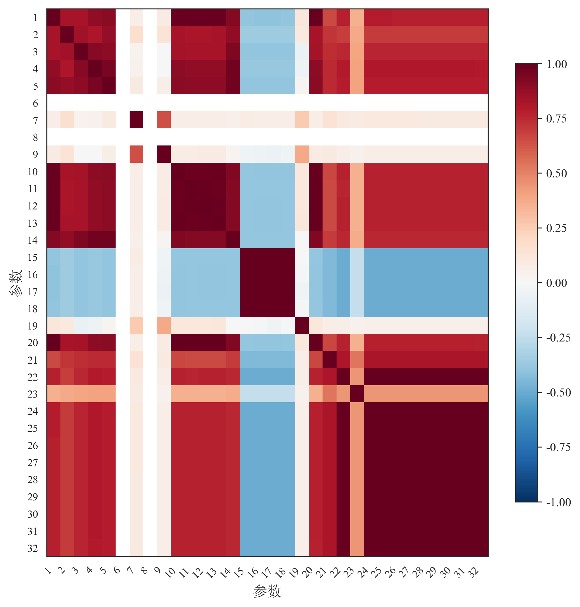
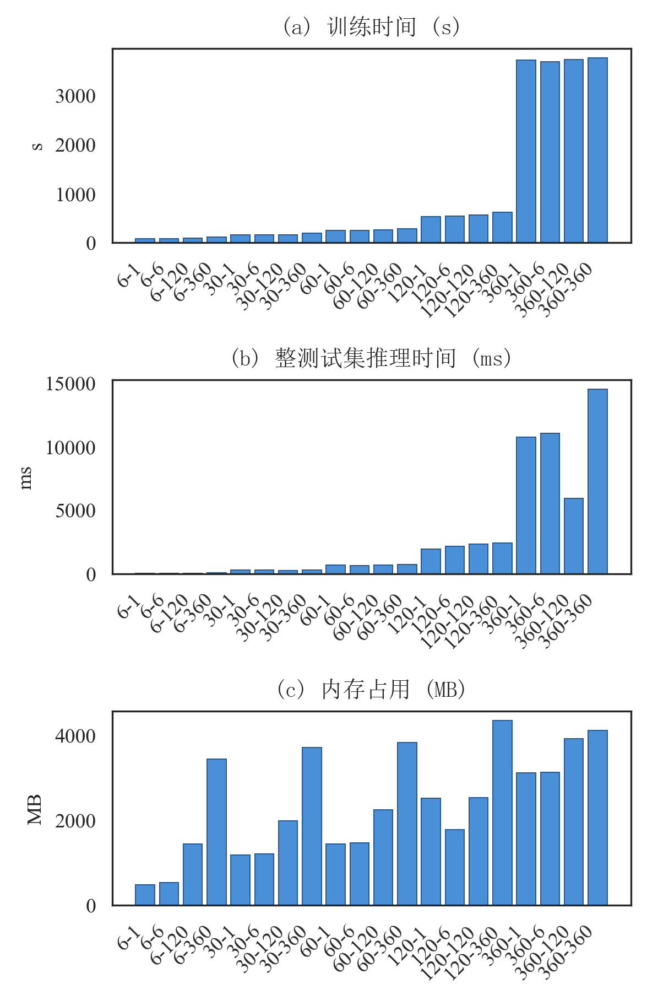
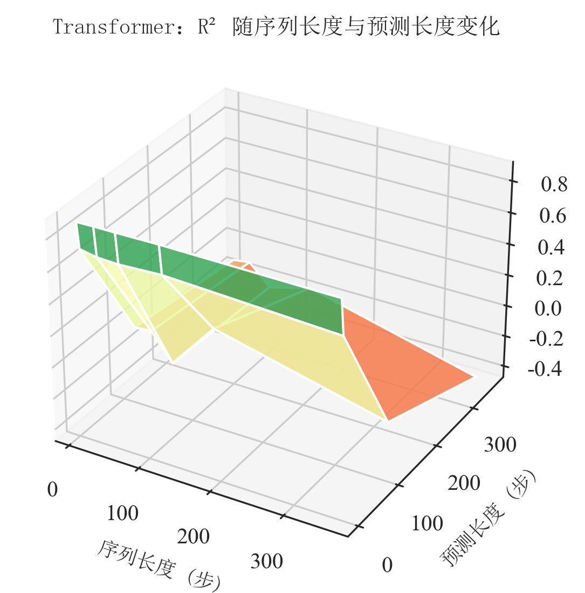
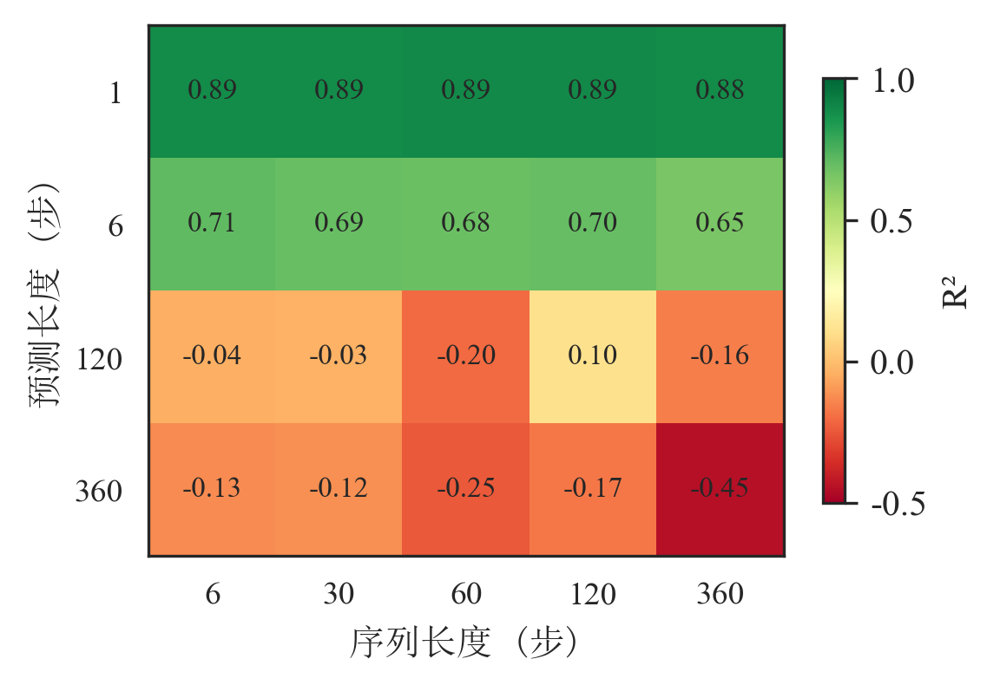
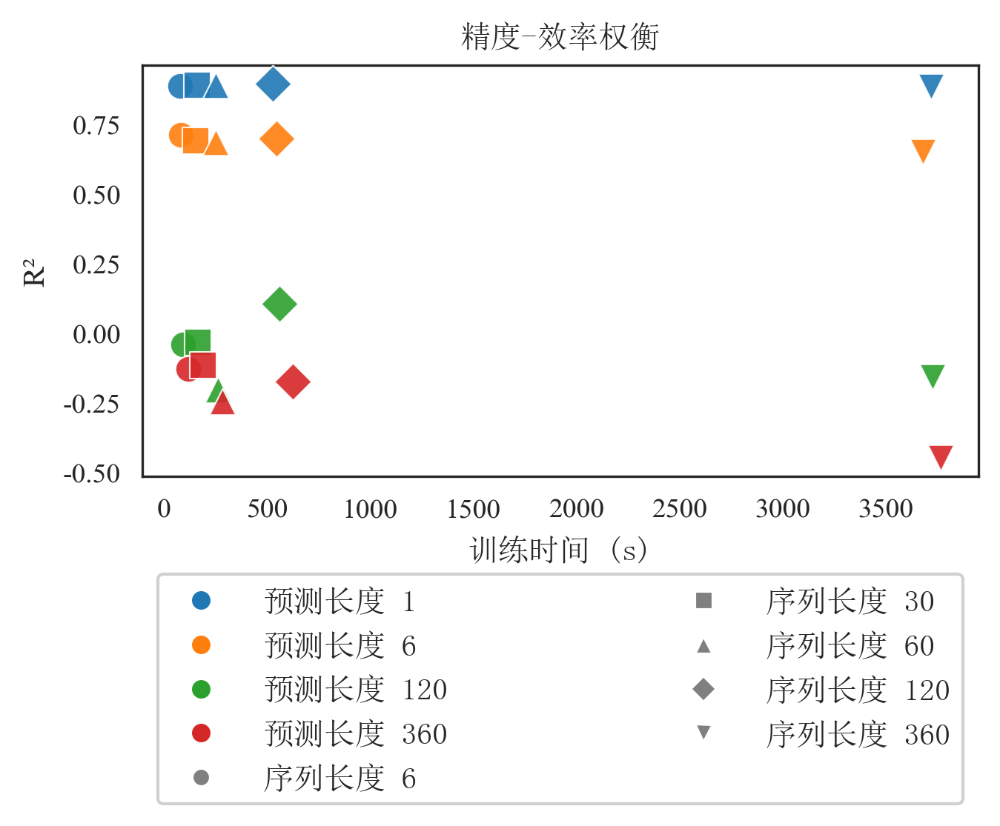
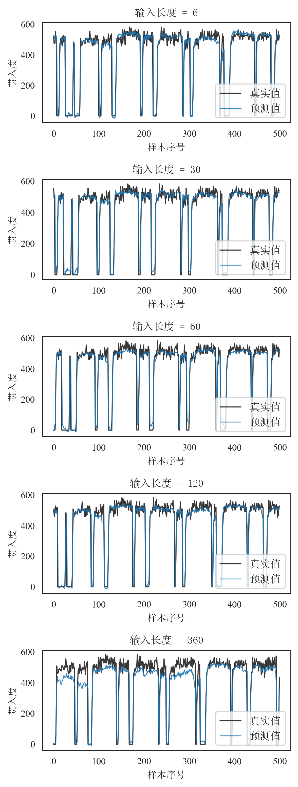
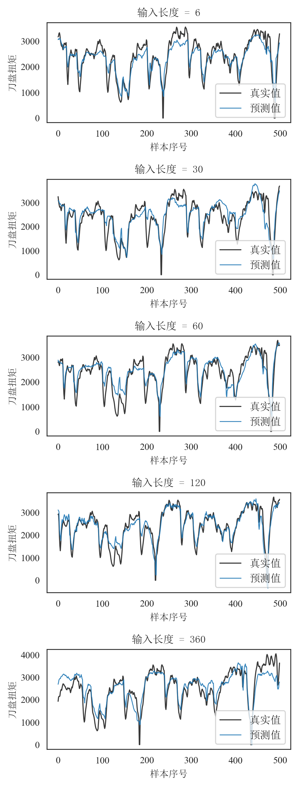
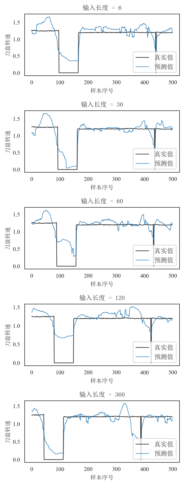

# 基于多头自注意力机制的盾构掘进关键参数多步实时预测研究

Research on Real-Time Multi-Step Prediction of Key Shield Tunnelling Parameters Based on Multi-Head Self-Attention Mechanism

李奇涛¹，姜红峰¹，许斌²，崔帅文³，徐金峰⁴\*

1. 中交一公局第八工程有限公司，天津 300171  
2. 交通运输部公路科学研究院，北京 100088  
3. 南洋理工大学，新加坡 639798  
4. 华南理工大学土木与交通学院，广东 广州 510640

通讯作者：徐金峰

---

摘要：复杂地层盾构施工中，推进压力、刀盘扭矩、土舱土压等多变量参数呈强耦合、快波动特征；在现场连续采样条件下，现场控制与风险预警要求预测结果可随新观测持续滚动更新，并在不同预报步长下保持稳定可用的前瞻能力。针对工程端“预测跨度需前瞻、计算开销需可控”的双重约束，本文提出多头自注意力驱动的多变量实时预测方法，构建输入长度T与预测跨度H协同配置评估框架。基于苏州地铁区间连续监测数据开展20组受控实验，统一比较精度、时效与计算代价。结果表明，H是性能衰减主导因子：短时预测稳定且T边际收益递减；当H扩展至120、360步时，单次直接多步输出显著退化。结合信息瓶颈与可预测性时域分析，形成“短跨度优先、滚动更新增强”的配置准则，揭示预测步长、历史窗口与计算成本的量化权衡，为盾构多变量智能预报的在线部署与跨区间迁移提供可复核的方法依据。

关键词：盾构掘进；多头自注意力；时间序列预测；预测步长；输入长度

Abstract: In complex shield tunnelling operations, key multivariate parameters (e.g., propulsion pressure, cutterhead torque, and chamber pressure) are strongly coupled and fast-varying; under continuous field sampling, control and risk-warning tasks require forecasts to be continuously refreshed with incoming observations and to remain practically reliable across different forecast horizons. To address the dual engineering constraint of actionable forecast span and controllable computation cost, this study develops a multivariate sequence prediction framework driven by multi-head self-attention, with a focus on the coupled design of history window length T and forecast horizon H. Using continuous monitoring data from a Suzhou metro shield section, we conduct a controlled benchmark over 20 (T,H) settings (5×4) under unified training protocols, and jointly evaluate predictive accuracy and computational cost. Results show that H is the dominant factor of performance degradation: short-horizon forecasting remains robust, while extending T yields limited marginal gains; when H increases to 120 and 360 steps, direct one-shot multi-step prediction deteriorates markedly, indicating joint constraints from representation capacity and predictability horizon. From information-bottleneck and temporal-predictability perspectives, we provide a mechanism-oriented interpretation and derive a practical strategy of preferring short horizons with rolling updates. The study contributes a reproducible experimental paradigm and configuration guideline for intelligent forecasting on continuous multi-regime tunnelling data, with conclusions bounded by the data and preprocessing conditions in this work.

Keywords: shield tunnelling; multi-head self-attention; time series forecasting; forecast horizon; input length

---

## 0 引言

盾构在复杂地层中掘进时，贯入度、推力、刀盘扭矩等关键参数的准确预测对施工安全与效率至关重要；尤其在软硬交替、多类地层交汇或下穿敏感建构筑物等条件下，在 5 s 采样序列上选取预测步数 H 即可获得秒至分钟量级的向前预报，可为掘进参数调整与风险预警提供依据。盾构推进、刀盘、土压等多子系统强耦合，多变量时序既呈现强耦合又呈现长程依赖，是数据驱动多变量时序预测的典型应用场景。工业与土木等领域中，“用多长历史（输入长度 T）、预测多远（预测长度 H）”均制约预测精度与计算成本，但在同一模型与数据下系统量化 T、H 对精度与效率的联合影响、并从可预测性理论角度加以解释的工作仍较缺乏。

当前时序预测前沿集中在数据驱动与深度学习：工业物联网积累了大量多变量时序数据，长程依赖建模、不同预测步长与输入长度（T–H）配置的联合优化成为热点。既有方法大致分为：（1）机理–数据混合模型：可解释性强、工况稳定时有效，但对复杂耦合与长程依赖依赖机理完备性。（2）统计模型（ARIMA、卡尔曼滤波等）：形式简洁、计算量小，线性或高斯假设对多变量非线性与长程依赖适应性有限。（3）浅层机器学习（SVM、随机森林等）：能捕捉非线性，在较小 H 下有效，对多变量联合表示与长序列依赖能力不足，T、H 选型多依赖经验。（4）循环网络（LSTM/GRU）：通过隐状态刻画时序依赖，但训练串行、长序列上梯度易衰减，且多数工作仅针对单一 (T, H) 评估。（5）Transformer 及其变体：自注意力在 $O(T^2)$ 下直接建模任意位置对，无需递归即可实现长程依赖；多头设计便于多变量与多时间子空间表示，编码器可并行计算。时序中常见做法包括编码器–解码器逐步生成、仅编码器加直接多步输出及 Informer、Autoformer 等变体；在盾构等工业应用中，仍缺乏同一架构下对多种 (T, H) 的系统对比及从信息瓶颈、可预测性时域等理论对选型规律的解读。

针对上述缺口，以苏州某地铁盾构区间工程为背景，本文采用注意力编码与直接多步映射相结合的统一建模框架，以盾构掘进关键参数预测为应用，系统量化 T 与 H 对精度与效率的联合影响，并从信息瓶颈与可预测性时域两个视角给出与下文实验现象相衔接的解释。数据来源于苏州相城区春光路站—春秋路站区间盾构施工实时监测系统，该区间沿中市路南行，穿越多类地层并下穿兴隆中市桥、复建寿人桥及沿街建构筑物，工程与环境条件具有代表性。在固定上述架构下，设置 5 种 T 与 4 种 H、共 20 组配置，考察其对预测精度（MSE、MAE、RMSE、R²）与计算效率（训练时间、推理时间、内存）的联合影响，提炼面向部署的参数选型法则、性能边界与可迁移实验范式。全文结构：第 1 节为工程概况、问题定义、数据与模型及评估指标；第 2 节为实验设计；第 3 节为结果与分析（含架构与可预测性时域角度的解读）；第 4 节为结论与工程启示。

---

## 1 方法

### 1.1 工程概况

本研究数据取自苏州相城区某地铁线春光路站—春秋路站区间盾构工程。区间右线长约 1345 m、左线约 1340 m，采用盾构法施工，设矿山法联络通道 2 处、内置泵房 1 处。区间自春光路站出站后沿中市路南行，下穿兴隆中市桥、中市路两侧沿街商铺及住宅、复建寿人桥后到达春秋路站；左右线均设平曲线（半径 500 m、1000 m），线间距约 13～14 m，隧道埋深约 9.6～18.89 m，纵坡呈“V”型。穿越主要地层包括④2粉砂、⑤1粉质粘土、⑥1粉质粘土、⑥2粉质粘土、⑥t粘质粉土等。场地属长江三角洲南缘冲湖积平原，地形平坦，区间下穿明浜与桥梁，环境与地质条件较复杂。区间采用加泥式土压平衡盾构施工，衬砌环外径 6600 mm，管片宽度 1200 mm。在上述工程背景下，掘进参数受地层变化、下穿建构筑物及纵曲线等因素影响，多变量时序呈现强耦合与长程依赖，适合作为关键参数在不同 (T, H) 配置下预测的实证对象。

### 1.2 问题定义

将盾构掘进关键参数预测形式化如下：给定历史 T 个时间步的 F 维参数序列 $X = \{x_{t-T+1}, \ldots, x_t\}$，$x_i \in \mathbb{R}^F$，预测未来 H 个时间步的序列 $Y = \{y_{t+1}, \ldots, y_{t+H}\}$，$y_i \in \mathbb{R}^F$。其中每一时间步对应一次采样时刻，F 为掘进参数维度（本文 F＝32）。本文以 5 s 为时间步长，序列长度 T 与预测长度 H 均以“步”计，一步对应 5 s；例如 T＝120 表示以 10 分钟历史为输入，H＝6 表示预测未来 30 秒。模型学习映射 $f_\theta: X \mapsto Y$，在给定 (T, H) 下通过监督学习最小化训练集上的期望损失（本文采用 MSE）以拟合参数 $\theta$。从学习理论角度，T 决定了模型可用的“因果时窗”——只有该窗内的历史参与条件分布 $p(Y|X)$ 的估计；H 则决定了需从同一表示中解码的“未来跨度”，二者共同定义了假设空间与任务难度。后文凡比较“预测多远”，一律写清**预测步数 H**，并给出由本文采样间隔（5 s）换算得到的**向前预报物理时间**（秒、分钟），不另用“中期、长期”等易与施工计划混用的说法。

多步预测在形式上可分为两类。（1）直接多步：一次映射 $f_\theta(X) = \hat{Y}$，所有未来步由同一前向传播得到。（2）自回归多步：$\hat{y}_{t+k} = g_\theta(X, \hat{y}_{t+1}, \ldots, \hat{y}_{t+k-1})$，逐步生成。本文采用直接多步。需进一步说明，在线“滚动更新”与“自回归预测”在方法机制上存在本质差异：前者在每个更新时刻均以新到达的实测数据重构输入窗口并重新预测，后续输入不包含历史预测值；后者则将已预测值继续作为后续时刻的输入。其优点是推理阶段无逐步误差传播、实现简单且单次推理延迟确定；代价是模型必须从同一上下文表示同时预测多步，远期步的可预测性受限于系统内在的可预测性时域。在动力系统与随机过程理论中，条件方差 $\mathrm{Var}(y_{t+h} | X)$ 通常随预测步长 $h$ 增大而增大甚至趋于饱和：一方面，许多动力系统具有正的 Lyapunov 指数或混合性，初始条件的不确定性会随时间指数或代数放大；另一方面，观测与过程噪声在多步累积下使条件分布逐渐趋近于平稳边际分布，有效信息衰减。因此“远期更难预测”在信息论意义上对应条件熵 $H(y_{t+h}|X)$ 随 $h$ 非减；在均方误差意义下则对应最优预测的误差随 $h$ 增大。直接多步要求单次映射同时拟合 $h=1,\ldots,H$ 的分布，模型容量被摊薄到各步，且无法像自回归那样在每一步利用已预测值做条件细化，故预测长度 H 成为主导精度的首要因素具有理论必然性。输入长度 T 则决定“用多少历史信息”形成表示，与系统的有效记忆长度、因果时窗及编码器能利用的上下文范围有关；T 过短会损失必要的历史依赖，过长则增加计算成本并可能引入与当前预测步无关的冗余，后文将从边际收益角度进一步讨论。

综上，在给定 (T, H) 下，问题定义明确了学习目标与任务难度来源：T 界定条件信息集，H 界定需联合预测的未来步数及随之而来的不确定性递增，二者共同约束了任意模型（包括本文的注意力编码框架）在该任务上的性能上界与合理的配置选型空间。

### 1.3 数据与预处理

数据集预处理：数据来源于该区间盾构施工实时监测系统，采样间隔 5 s。该间隔在工程上对应盾构推进与刀盘控制的典型操作节奏，既能捕捉地层–机械交互在数十秒尺度上的变化，又避免过高采样带来的冗余与存储负担；在方法上则直接决定了“一步”所对应的物理时间，从而将抽象的 T、H（步数）与“用多长历史、预测多远”（分钟/秒）建立对应关系。经合并、去缺与格式统一后，得到以时间顺序排列的连续序列；前 5 列为元数据（管片号、行程、日期、时刻、掘进状态），其后为 32 维数值型掘进参数，包括贯入度、四腔室推进压力、土舱土压、推进油缸总推力、千斤顶速度与行程、刀盘转速与扭矩及 No.1～No.10 刀盘电机扭矩等。盾构虽有停机拼装阶段，但监测数据仍以 5 s 持续入流，部署时采用滚动预测（窗口随新观测滑动更新。离线实验聚焦单次前向输出跨度 H，对不同 (T, H) 的直接多步设置做并行对照。

样本构造与划分：按给定序列长度 T 与预测长度 H 以滑动窗口方式构造输入–输出样本，得到若干组 $(X, Y)$。滑动窗口保证了相邻样本在时间上重叠，从而充分利用数据并保持时序的连续性；同一段历史可参与多个样本的构造，但每个样本的 (T, H) 固定，便于在同一配置下进行无偏的监督学习。划分时按 70%∶15%∶15% 沿时间顺序切分为训练集、验证集与测试集，不打乱时序，以避免信息泄露并与“用过去预测未来”的部署场景一致。验证集用于早停与超参数监控，测试集仅用于最终报告指标。

多变量结构与相关性：如图 1 所示，对合并后的全序列，在剔除元数据列后，对 32 维掘进参数计算 Pearson 样本相关系数：第 \(i\) 列与第 \(j\) 列（\(i,j=1,\ldots,32\)）的相关系数为两列在全部时间步上配对样本的 Pearson \(r_{ij}\)（与 \(r_{ji}\) 对称），得到 \(32\times32\) 对称矩阵并以热力图展示；对角线为 1，横纵轴均为特征序号 1～32（与文中特征排列顺序一致）。该图刻画的是变量间静态线性相关结构，不区分掘进/停掘阶段，亦未对滞后互相关单独建模。从物理上，推进压力、推力、贯入度、刀盘扭矩等由同一掘进过程与地层–机械耦合所驱动，存在强耦合与滞后关系；从建模角度，强相关意味着若仅做单变量预测会损失大量跨变量信息，多变量联合建模可显式利用这些依赖关系，并借助注意力机制的多头表征能力在不同子空间上捕捉不同变量组或时间尺度的模式，因此本数据适合作为多变量、不同 (T, H) 下预测的实证载体。

  
图1 32 维掘进参数 Pearson 相关系数矩阵热力图（全序列配对样本；横纵轴：特征序号 1～32）

### 1.4 注意力编码预测模型

本小节概述为何采用注意力编码框架及“仅编码器 + 单线性多步输出”的设计，给出结构与数据流、超参数，并从计算复杂度、架构性质及信息与表示角度解读 T、H 如何通过该架构影响精度与效率。

为何采用注意力编码框架及当前简化形式：该类模型在时序预测中的优势在于：（1）自注意力可在 $O(T^2)$ 复杂度下对序列内任意位置对进行直接建模，无需像循环网络那样沿时间步递归，从而在结构上避免长程梯度衰减，并便于并行计算；（2）多头设计使模型能在不同子空间上关注不同时间片段或变量组合，与盾构多变量、多物理量耦合的时序特性相契合；（3）编码器仅做“历史→表示”的编码，不引入解码器或自回归，便于在同一框架下公平比较不同 (T, H) 组合，且推理延迟确定、无误差传播。本文采用仅含编码器的注意力模型进行多变量多步预测，其核心为自注意力（self-attention）机制与“仅取最后一时间步表示 + 单层线性输出”的映射方式；该简化使信息流清晰、可复现性强，并便于从信息瓶颈与可预测性时域角度对不同 (T, H) 下的预测现象做统一解释。

**主要公式（与实现一致的缩略记法）** 记输入经线性嵌入与位置编码后为 $H^{(0)}\in\mathbb{R}^{T\times d}$。第 $\ell$ 层编码器块中，缩放点积注意力为  
$$\mathrm{Attention}(Q,K,V)=\mathrm{softmax}\!\left(\frac{QK^\top}{\sqrt{d_k}}\right)V,$$  
其中 $Q=HW_Q,\;K=HW_K,\;V=HW_V$，$H$ 为上一层输出（或 $H^{(0)}$），$W_Q,W_K,W_V\in\mathbb{R}^{d\times d_k}$。多头拼接与线性投影写作  
$$\mathrm{MultiHead}(H)=\mathrm{Concat}(\mathrm{head}_1,\ldots,\mathrm{head}_M)W^O,\quad \mathrm{head}_m=\mathrm{Attention}(Q_m,K_m,V_m).$$  
子层残差与层归一化采用 Pre-LN 或 Post-LN 形式之一（与代码一致即可），前馈网络为  
$$\mathrm{FFN}(z)=\max(0,zW_1+b_1)W_2+b_2.$$  
取最后一时刻隐向量 $h_T\in\mathbb{R}^d$，直接多步输出为  
$$\hat{Y}=\mathrm{reshape}(W_{\mathrm{out}} h_T + b_{\mathrm{out}})\in\mathbb{R}^{H\times F},\quad W_{\mathrm{out}}\in\mathbb{R}^{d\times (HF)}.$$  
训练目标为样本上的均方误差 $\mathcal{L}=\frac{1}{NHF}\sum_{n,i,f}(y_{n,i,f}-\hat{y}_{n,i,f})^2$。

结构与数据流：输入序列 $X \in \mathbb{R}^{T \times F}$ 经线性层投影到隐维度 $d$（本文 $d=64$），叠加正弦位置编码后送入多层注意力编码器。位置编码是必要的：自注意力本身对输入的置换不变，若不注入位置信息，模型无法区分时间先后，正弦编码则提供连续且可外推的位置表示。编码器内每一层包含多头自注意力与前馈子层：自注意力使每一时间步的表示均可依赖整段输入，从而在无需循环的前提下建模长程依赖；多 head（本文 4 头）便于同时关注不同时间或变量子空间。形式地，第 $\ell$ 层对位置 $i$ 的输出可写为对全体位置 $j=1,\ldots,T$ 的加权聚合，权重由 query–key 相似度决定，因此任意两时间步之间均可直接传递信息，最大依赖路径长度为 1（与 RNN 的 $O(T)$ 形成对比）。编码器输出为 $T$ 个时间步的隐状态，仅取最后一时间步 $h_T \in \mathbb{R}^d$ 作为整段历史的压缩表示，再经一层线性映射得到 $\hat{Y} = W h_T + b$，reshape 为 $(H \times F)$ 维，即未来 $H$ 步的预测。其中，$W \in \mathbb{R}^{d \times (H \times F)}$、$b \in \mathbb{R}^{H \times F}$ 分别为输出层权重与偏置。因此，无论 $H$ 为 1 还是 360，所有未来步均来自同一上下文向量 $h_T$ 的线性变换，中间无解码器、无自回归、无逐步修正。取最后一时间步而非对 T 步做池化，是因为“当前时刻”在因果预测中处于中心地位：$h_T$ 已通过自注意力融合了 $x_{t-T+1},\ldots,x_t$ 的全部信息，可视为当前时刻的状态表示；用该表示预测未来 $y_{t+1},\ldots,y_{t+H}$ 符合“仅用过去与当前信息预测未来”的因果约束，因此是自然的设计。

超参数：隐维度 64，注意力头数 4，编码器层数 2，前馈维度 256，Dropout 0.1；训练使用学习率 1×10⁻³、批大小 64、20 个 epoch。

计算复杂度与 (T, H) 的缩放：编码器部分的自注意力与序列长度 T 相关，每层复杂度为 $O(T^2 \cdot d)$，总参数量与 T、H 无关；输出层为 $d \times (H \cdot F)$ 的线性映射，参数量与 H 线性相关，前向与反向传播的 FLOPs 也与 H 线性相关。因此，训练与推理时间随 T 增大呈约二次增长、随 H 增大呈约一次增长；内存方面，注意力矩阵为 $T \times T$，显存占用随 $T^2$ 增长，长序列（如 T=360）时成为主要瓶颈。这一缩放规律直接支撑后文对“输入长度边际收益递减”与“输出步数 H 较大时预测成本高”的讨论。

架构带来的四条性质：（1）并行性：自注意力对序列各位置可并行计算，训练与推理在 GPU 上较高效，但注意力复杂度与序列长度平方相关，故长序列时计算与内存成本显著上升。（2）单步预测天然适配：下一时刻仅需从 $h_T$ 预测一步，$h_T$ 已融合整段历史，信息充分且无多步误差累积，故单步预测易取得较高精度；且对单步而言，模型只需学习“当前状态→下一时刻”的映射，表示压力最小。（3）预测步数 H 较大时的结构瓶颈：同一 $h_T$ 经单一线性层直接映射到 $H \times F$ 个输出，模型既无法为不同未来时刻使用不同表示，也无法像自回归模型那样“先预测 t+1、再以 t+1 为条件预测 t+2”；H 较大时表达能力被摊薄，且远期不确定性大，单一定长向量难以编码数十步乃至数百步后的细节，故大 H 下精度易急剧下降。（4）输入长度的边际收益：自注意力已使最后一步“看到”全部历史，对“下一步”而言近期历史往往贡献更大（可由注意力权重或梯度范数实证验证）；继续拉长输入主要增加更早时段的信息，对单步预测的边际贡献递减，而计算成本随 T 明显增加，故存在输入长度的边际收益递减现象。

从信息与表示角度的理论解读：可将当前架构视为“编码器–瓶颈–解码”结构：编码器将 $T \times F$ 维输入压缩为 $d$ 维向量 $h_T$，再经单层线性映射展开为 $H \times F$ 维输出。根据率失真与表示学习中的常见结论，定长向量在编码多步未来时存在容量上限：若将未来序列视为在给定历史下的条件分布 $p(Y | X)$，则 $h_T$ 需同时承载 $H$ 个时间步的统计信息，当 $H$ 很大时，有效信息被压缩进固定维度，必然带来信息损失；且条件熵 $H(y_{t+h} | X)$ 随 $h$ 增大通常不减（甚至随系统混沌性或噪声累积而增大），即“远期更难预测”在信息论意义下成立。因此，单步预测（$H=1$）仅需从 $h_T$ 解码一步，瓶颈压力最小；$H \gg 1$ 时同一瓶颈需支撑多步解码，性能下降是结构性的，而非仅调参可解决。T 与 H 同量级时在直观上可减轻表示跨度与预测跨度不一致的压力，但本文实验表明：H=120 时仅 (120,120) 的 R² 略大于 0，其余为负；H=360 时全部为负且 (360,360) 最差，故不宜将“对齐假设”与实证结果简单等同，需结合数据中的多工况形态、噪声与任务难度综合讨论（见第 3 节）。

### 1.5 评估指标

预测精度：采用均方误差（MSE）、平均绝对误差（MAE）、均方根误差（RMSE）及决定系数 R²。MSE 与本文训练损失一致，便于与优化目标直接对应，且对大方差更敏感；MAE 对异常值更鲁棒，与工程上“平均偏差”的直观一致；RMSE 与目标量纲相同，便于跨变量或跨配置比较。R² 定义为 $1 - \frac{\sum (y - \hat{y})^2}{\sum (y - \bar{y})^2}$，反映模型相对“始终预测均值”这一基准所能解释的方差比例：R²=1 表示完美拟合，R²=0 表示与均值预测相当，R²<0 表示不如简单均值预测。在 20 组 (T, H) 实验中，R² 便于在不同配置间做相对比较，且对量纲不敏感；其随 H 增大而下降、在 H 较大时甚至为负，可直接印证“可预测性随预测时域衰减”的理论预期。四类指标联合使用可兼顾优化目标（MSE）、鲁棒性（MAE）、量纲可解释性（RMSE）与相对性能（R²）。

计算性能：记录训练时间（s）、整测试集推理时间（ms）与峰值内存占用（MB）。训练时间反映不同 (T, H) 下达到收敛所需的算力，与自注意力 $O(T^2)$ 及输出维度 $O(H)$ 的缩放一致，是配置选型时的重要约束；推理时间决定实时或准实时部署时的延迟上限；内存占用则制约可部署的硬件与批大小。三者共同刻画不同 (T, H) 配置下的可部署性与资源成本，为第 3 节精度–效率权衡分析提供依据。

---

## 2 实验设计

本节说明实验目标、(T, H) 配置的设计依据、样本与数据划分、训练与评估设置，以保证结果可复现且组间可比，并确保实验设计能回答“T、H 如何联合影响精度与效率”及“如何从理论角度解释这些影响”。

实验目标：在统一数据与模型前提下，系统改变输入序列长度 T 与预测长度 H，量化二者对预测精度（MSE、MAE、RMSE、R²）与计算效率（训练时间、推理时间、内存占用）的影响，为工程中的配置选型提供实证依据，并支撑第 3 节对精度–效率权衡、模型适用边界及“信息瓶颈–可预测性时域”解释的讨论。设计上需满足：（1）T、H 均有足够跨度，以覆盖从较短历史窗口、H=1 到较长历史窗口、较大 H 的直接多步预报；（2）组间除 (T, H) 外其余条件一致，使差异可归因于 (T, H) 配置；（3）指标同时包含精度与计算成本，以便提炼选型原则。与监测系统联动时，预测按时间滑动窗口**滚动**推进：新数据到达即刷新输入并重算输出。离线阶段需要先行比较**单次前向输出取不同步数 H** 时的精度与代价，故对每一组 (T, H) 独立训练、独立评估；若较大 H 下单次直接输出误差显著放大，则与现场采用**较小 H、滚动累进**的用法自然衔接。

(T, H) 配置：工程中需根据应用场景选择“用多长历史（T）、预测多远（H）”，不同 (T, H) 对应不同的精度–成本权衡与适用场景，但此前缺乏在同一数据与模型下的系统对比。为给出配置选型的定量依据，本文固定其他条件，将输入序列长度 T 取 6、30、60、120、360 步，预测长度 H 取 1、6、120、360 步，构成 5×4＝20 组配置。T 的选取覆盖从约 0.5 分钟（6 步）到 30 分钟（360 步）的历史窗口，便于观察“输入长度边际收益”及“过长输入是否带来精度提升”；H 取 1、6、120、360 步，在 5 s 采样下分别对应向前预报约 5 s、30 s、10 min、30 min，用于观察**预测步数 H 增大**时精度与效率的变化，并验证“预测长度主导精度”，以及在固定直接多步设定下不同 (T, H) 的相对优劣（含 T 与 H 步数相等的情形，不预设其必然最优）。时间步长为 5 s，故上述 T 分别对应约 0.5、2.5、5、10、30 分钟历史。每组 (T, H) 独立训练一个模型并单独评估，不共享参数，以便直接比较不同 (T, H) 组合下的精度与效率，并避免“多任务”或“多配置”联合训练带来的混淆。

样本构造与数据划分：按第 1.3 节方法，以滑动窗口方式按给定 T、H 从连续时序构造输入–输出样本；沿时间顺序将样本划分为训练集 70%、验证集 15%、测试集 15%，不打乱顺序以避免信息泄露。验证集用于训练过程中的早停与超参数监控，测试集仅用于最终报告指标，不参与训练与模型选择。

训练设置：模型结构及超参数与第 1.4 节一致（隐维度 64，4 头注意力，2 层编码器，前馈维度 256，Dropout 0.1）；训练采用 Adam 优化器、学习率 1×10⁻³、批大小 64、固定 20 个 epoch，损失函数为均方误差（MSE）。20 组实验除 (T, H) 外其余超参数与数据划分方式完全相同；实验在固定随机种子与相同软硬件环境下进行，以保证组间可比性与结果可复现性。

评估与记录：每组实验在测试集上计算预测精度的 MSE、MAE、RMSE、R²（与第 1.5 节一致），并记录该组从训练开始到结束的 wall-clock 训练时间、整测试集一次前向推理时间及峰值内存占用。上述指标用于第 3 节的精度分析、计算性能分析与精度–效率权衡讨论。

---

## 3 结果与分析

### 3.1 预测精度

20 组实验中，R² 分布于 -0.447（输入长度 360 步、预测长度 360 步）至 0.892（输入长度 120 步、预测长度 1 步）；MSE 自约 0.080 至约 1.056，MAE 自约 0.129 至约 0.758，与“预测长度增加导致误差累积与不确定性增大”的预期一致。

按预测长度分层可见：（1）预测长度 1 步：五种输入长度下 R² 均在 0.884～0.892 之间，输入 120 步时最优（R²=0.892），输入仅 6 步时已达 R²=0.886，说明单步预测对历史长度不敏感。（2）预测长度 6 步：R² 在 0.649～0.710，输入 6 步时最高（0.710），输入 360 步时最低（0.649），过长输入未带来精度提升。（3）预测长度 120 步：仅当输入长度同为 120 步时取得正 R²（0.104），其余均为负。该正 R² 数值很小，仅能视为相对其它 T 略好，不能概括为“匹配即有效”。（4）预测长度 360 步：各配置 R² 均为负，其中 (360,360) 约 -0.447，为全局最低之一，H=360 步时直接多步预报在本数据与模型下难度较大。如图 3 所示，四类精度指标在 20 组配置下的表现以柱状图形式给出。

  
图3 预测精度指标在 20 组配置下的表现 （a）R²；（b）MSE；（c）MAE；（d）RMSE

### 3.2 计算性能

本节结果均在同一计算环境下获得：Windows 11 Pro（10.0.26200）、AMD Ryzen 9 7945HX、32 GB 内存、NVIDIA GeForce RTX 4060 Laptop GPU，软件环境为 Python 3.12.7 与 PyTorch 2.6.0（CPU 版本，CUDA 不可用）。训练时间随序列长度与预测长度增加而明显上升，与自注意力复杂度及输出维度随 (T, H) 增大一致。单步预测下，输入 6 步约 80 s，输入 120 步约 529 s，输入 360 步约 3718 s；自 6 步增至 120 步，训练时间增加约 6.6 倍，而 R² 仅自 0.886 提升至 0.892（约 0.6 个百分点），呈现明显的边际收益递减，说明在单步预测场景下采用过长输入从成本上不划算。整测试集推理时间自约 48.6 ms（6 步输入、1 步预测）至约 14.5 s（360 步输入、360 步预测），内存占用自约 484 MB 至约 4104 MB，长序列（大 T）与较大 H 的配置对部署设备的算力与内存要求较高。如图 4 所示，训练时间、推理时间与内存占用在 20 组上的对比便于在精度与资源之间做权衡。

  
图4 计算性能在 20 组配置下的表现 （a）训练时间；（b）推理时间；（c）内存占用

### 3.3 输入长度与预测步长对 R² 的联合影响

如图 5 与图 6 所示，分别以三维曲面与热力图展示 R² 随输入序列长度与预测长度的变化。从曲面与热力图可归纳出以下规律：高 R² 区域集中在预测长度 1 步与 6 步两行，且沿输入长度方向（列方向）变化不大，说明在 H 为 1、6 步时增加历史长度对精度提升有限；H 为 120 步时仅输入 120 步一格为正（0.104），形成热力图上的“对角线亮点”，其余输入长度下均为负；H 为 360 步时整行为负，右下角 (360, 360) 最低。整体表明预测步数 H 是主导精度的首要因素，输入长度在较小 H 下为次要因素。工程选型时可先根据应用需求确定预测长度，再在满足精度前提下尽量缩短输入长度以控制计算成本。在 H=360 下“T=H”并未改善精度。需区分：在线场景宜**滚动更新**；本文离线网格检验的是**单次直接多步取不同 H** 时的优劣，未再单列“是否采用滚动算法”的对照实验。结果支持**短 H + 滚动**而非**一次拉满长 H**。

  
图5 R² 随序列长度与预测长度变化
  
图6 R² 热力图（行：预测长度；列：序列长度）

### 3.4 精度–效率权衡

如图 7 所示，以训练时间为横轴、R² 为纵轴绘制 20 组配置的散点，颜色表示预测长度，标记形状表示序列长度。高 R² 点均对应预测长度 1 步，其中输入 120 步、预测 1 步以约 529 s 训练获得 R²=0.892；预测长度 6 步时，输入 6 步以约 82 s 达到 R²=0.71，在精度与成本间较为均衡；预测长度 120 步与 360 步的配置普遍 R² 较低或为负且训练成本高。综合精度与效率，单步预测下输入 120 步为较优选择，资源受限时可选用输入 6 步或 30 步以在损失较小精度的前提下降低计算成本。

  
图7 精度–效率权衡（颜色：预测长度；形状：序列长度）

### 3.5 典型预测曲线

为直观展示不同 (T, H) 配置下的预测效果，分别选取贯入度、推进油缸总推力、刀盘扭矩、刀盘转速四个代表性参数，固定预测长度依次为 1、6、120、360 步，在各预测长度下给出输入长度 6、30、60、120、360 步的五组真实值与预测值曲线（图 8～11，测试集前 500 样本）。从曲线形态可见：预测长度 1 步时五组曲线均能较好跟踪真实值，与 R² 均高于 0.88 的定量结果一致；预测长度 6 步时拟合尚可但波动与偏差较单步增大；预测长度 120 步时仅输入 120 步一组跟踪尚可，其余输入长度下预测明显滞后或偏离；预测长度 360 步时各组偏差均较大，曲线难以跟踪真实变化。曲线时间轴上既有掘进也有停掘、拼装等引起的缓变或平台段，预测仍能与实测形态相衔接，说明模型从连续入流数据中学习到了**跨工况片段**的时序结构，而非仅在单一“理想掘进”形态上有效。上述现象与 3.1～3.3 节的定量结论一致，即预测长度为主导因素。在 H=120 时 (120,120) 略优于其它 T，但在 H=360 时 (360,360) 并非更优，故“T 与 H 相符”不构成一般性结论。

### 3.6 从模型架构对预测性能的解读

本节将前述实验结果与 1.4 节的架构特点对应，从为何单步预测表现优、为何随 H 增大精度骤降、为何输入长度存在边际收益递减，以及“T 与 H 同值”在实验中为何仅在部分 H 上略优于其它 T四个方面，给出基于模型结构的解释。

本模型仅用编码器最后一时间步的隐状态 $h_T$ 经一层线性映射得到预测。当预测长度为 1 步时，只需从 $h_T$ 预测一步即可；$h_T$ 经自注意力已聚合整段输入信息，对“下一时刻”而言信息充足，且不存在多步误差累积。因此单步预测在 20 组配置中 R² 均达 0.88 以上，与“单向量 + 单步输出”的架构高度契合，这是单步预测普遍取得高精度的主要原因。

预测长度增大后精度明显下降，则与架构约束直接相关。同一 $h_T$ 经同一线性层直接输出 $H \times F$ 个标量（$H=6,120,360$）。架构上既未区分“近期”与“远期”未来步，也未采用自回归或解码器逐步生成，所有未来步共享同一表示与同一映射，模型容量被摊薄；且随 $H$ 增大，远期不确定性上升，单一定长向量难以编码数十步后的细节。这与实验中预测长度 120 步、360 步时 R² 大幅下降甚至为负的结果一致，说明当前仅编码器加单线性输出的设计在结构上更适合较小 H 的预测。

输入长度在单步预测下呈现边际收益递减，同样可从自注意力机制得到解释。自注意力使最后一步已能访问全部输入步，对“下一步”最有用的多为近期历史；继续增加输入长度主要增加更早时段的信息，对单步预测的边际贡献有限。实验中 6 步输入即达 R²=0.886，增至 120 步仅提升至 0.892（约 0.6 个百分点），而训练时间约增 6.6 倍，与“注意力已覆盖全序列且单步预测更依赖近期”的机制相符；输入 360 步时 R² 略低于 120 步，可能与更长序列带来的优化难度或过拟合倾向有关。

预测长度 120 步时，仅当输入长度同为 120 步时取得正 R²（0.104）。相对其它 T 略好，但绝对精度仍低。从结构上看，输入 120 步、输出 120 步在步数跨度上对称，编码器与输出层在“跨度”上一致，模型可能更易学习“用 120 步历史概括并预测 120 步未来”的映射；而输入 6 步、输出 120 步则要求从极短上下文预测长未来，结构上不匹配，精度显著恶化。预测长度 360 步时即便输入 360 步仍全部为负 R²，且 (360,360) 为最差配置之一，说明“对称跨度”并不保证优于其它 (T,H)。在本文数据与模型规模下，单向量表示难以支撑 360 步的**单次**直接多步输出；**部署上**宜以较短 H 配合**滚动递推**与实时修正，而非一次输出极长未来。与纯算法层面的滚动策略、误差修正作对比，可作为后续方法学扩展。

从时序预测理论角度，可将上述现象归纳为两点。其一，预测长度主导精度对应“可预测性随预测时域衰减”：在多数实际系统中，条件分布 $p(y_{t+h} | x_{1:t})$ 的方差随 $h$ 增大而增大，或有效信号随 $h$ 衰减，R² 随 H 增大而下降是预期现象；本模型采用直接多步且无自回归修正，所有未来步共享同一表示，故 H 的负面影响被进一步放大。其二，上述同量级启发可部分解释 H=120 时 T 过小会显著变差，但不足以解释 H=360 时 (360,360) 的劣势，亦不能替代实证。工程上本文可支持的原则限于：在**单次直接多步、固定 H** 的离线评估框架与本文数据条件下，优先**较短 H** 与适度 T；在线则与**滚动更新**配合。与机理/统计融合或不同滚动实现作严格对照，需另设实验，不宜由本文外推。

综上，实验现象可从注意力编码框架的“单步上下文 + 单线性多步输出”设计及可预测性时域理论得到一致解释。自注意力带来的长程依赖与并行计算优势在较小 H 与适中 T 下得到充分发挥，而单向量多步输出的结构边界与预测时域增大带来的不确定性增长共同决定了该框架在本类任务中的适用配置区间。上述分析为后续改进（如引入解码器、自回归、与机理模型结合，或在**算法层面**增设不同滚动/递推策略的受控对比）指明了方向。

  
图8 贯入度：真实值与预测值（预测长度 1 步）

  
图9 推进油缸总推力：真实值与预测值（预测长度 6 步）

  
图10 刀盘扭矩：真实值与预测值（预测长度 120 步）

  
图11 刀盘转速：真实值与预测值（预测长度 360 步）

---

## 4 分析与讨论

### 4.1 工程应用启示

基于本文实验结果与架构分析，对工程应用提出以下建议。配置选型方面，在保持采样间隔与特征维度一致的前提下，新工地可参照本文的 20 组设置进行小规模试验，根据精度与训练/推理时间权衡选择配置。实时或轻量部署可优先输入 6 步或 30 步、预测 1 步，在损失较小精度的前提下显著降低计算成本；精度优先且可接受约 9 分钟训练时可选用输入 120 步、预测 1 步；短期 6 步预测可考虑输入 6 步或 120 步、预测 6 步。大 T 与较大 H 的组合（如 360–120、360–360）计算成本高而精度差，不宜作为首选。

在部署与扩展方面，该注意力框架在长序列下训练与推理成本较高，更适用于离线高精度分析；对延迟敏感的场景可缩短输入长度或采用轻量化结构。H 为 120、360 步（约 10 min、30 min 向前预报）时，单次直接多步输出的 R² 整体较差；与**滚动刷新输入、取较短 H、随新数据重算**的在线用法相配合更为合理。机理或统计融合可作为提升可解释性与稳健性的补充路径，需在统一指标下另行设计对比。

### 4.2 创新点与局限

本文的主要贡献包括：（1）在同一工程与数据基础上，系统考察了注意力驱动框架在 5×4 共 20 组 (T, H) 组合下的性能响应面，从精度与计算效率两方面进行评估，凸显了该框架在长程依赖建模与多变量耦合表征中的工程价值；（2）给出了基于实验结果的配置选型启示与边际收益分析，为盾构施工智能化中 (T, H) 配置提供了依据；（3）从编码器“单步上下文 + 单线性多步输出”的架构特点出发，结合信息瓶颈与可预测性时域两个理论视角，对 H 较小时精度较好、随 H 增大精度下降、输入长度边际递减及不同 (T,H) 组合的相对表现（含 T=H 非普适占优）等现象给出了与本文数据一致的解释，将性能与模型结构特性及连续监测数据中的多工况片段联系起来，为后续模型改进指明了方向，并提供了可推广到其他仅编码器、直接多步的时序模型的选型与解读框架。

本研究存在以下局限：实验限于单一区间、单一机型及固定超参数，结论在更多地层与机型上的泛化能力尚待验证；在 H 为 120、360 步（约 10 min、30 min 向前预报）时直接多步预测效果有限，且离线网格未与“不同滚动递推实现”“误差修正模块”等作算法级系统对比——本文重点在 (T,H) 扫描与直接多步评估，与在线滚动部署在层级上并不等同。掘进与停掘片段均包含在训练与测试序列中，典型曲线显示模型对两类片段均能跟踪；若需单独评价纯掘进段表现，可另设状态筛选作对照，留待后续。后续将在更多地层与机型上验证泛化能力，并探索轻量化 注意力编码架构、分段/状态条件化数据构建及与其他模型的融合，以兼顾精度与实时性。

本文所提出的选型原则与 (T, H) 设计建议在所述数据与模型条件下能够为配置选型提供依据，并在多数 H=1 与较小 H 的场景下取得较好精度，但仍面临单一工程数据、固定架构与未系统对比滚动预测与误差修正等方法的局限。未来研究应结合更多区间与机型数据验证泛化能力；对**单次前向需输出较大步数 H** 的预测任务，宜在统一数据与指标下将不同滚动递推实现、解码器/自回归结构及机理或统计模型融合等作为可对照的基线开展实验，再形成可复核的工程建议。

---

## 5 结论

本文以春光路站—春秋路站区间盾构掘进关键参数为对象，在仅编码器 + 单线性多步输出的注意力编码架构下，系统考察了 5 种输入长度与 4 种预测长度共 20 组配置对预测精度与计算效率的联合影响，并从信息瓶颈与可预测性时域两个视角对现象进行了理论解读。主要结论如下。

（1）预测长度是影响精度的主导因素，单步预测下 R² 普遍在 0.88 以上，随预测长度增大精度显著下降；输入长度在单步预测下存在边际收益递减，适中的输入长度（如 60～120 步）更利于在精度与成本间取得平衡。

（2）在 H=120 步时，仅 T=120 步时 R² 勉强为正，其余为负；在 H=360 步时全部配置为负，且 T=H=360 并非改善而为全局最劣之一。**单次**大 H 直接多步在本设定下效果差，与**在线取较小 H、滚动修正**的部署思路一致；与机理或统计模型融合等可作为后续受控对比内容，非本文已验证结论。计算成本随序列与预测长度显著增加，实时或资源受限场景宜采用较短 T 与较小 H，离线高精度分析可选用输入 120 步、预测 1 步的配置。

（3）从“编码–瓶颈–解码”结构与可预测性时域理论可对本文观测到的主要规律给出解释，为该工程数据条件下盾构掘进关键参数在不同 (T, H) 配置下预测的讨论提供了案例性依据与理论参照。

---

论文图片中英文标题对照表

| 图号 | 中文标题 | English Title |
|------|----------|---------------|
| 图1 | 32 维掘进参数 Pearson 相关矩阵热力图（全序列配对样本；横纵轴：特征序号 1～32） | Pearson correlation matrix heatmap of 32 tunnelling parameters (paired samples over all time steps; axes: feature indices 1–32) |
| 图3 | 预测精度指标在 20 组配置下的表现（a）R²；（b）MSE；（c）MAE；（d）RMSE | Prediction accuracy metrics under 20 configurations (a) R²; (b) MSE; (c) MAE; (d) RMSE |
| 图4 | 计算性能在 20 组配置下的表现（a）训练时间；（b）推理时间；（c）内存占用 | Computational performance under 20 configurations (a) Training time; (b) Inference time; (c) Memory usage |
| 图5 | R² 随序列长度与预测长度变化 | R² versus input sequence length and prediction length |
| 图6 | R² 热力图（行：预测长度；列：序列长度） | R² heatmap (rows: prediction length; columns: input sequence length) |
| 图7 | 精度–效率权衡（颜色：预测长度；形状：序列长度） | Accuracy–efficiency trade-off (colour: prediction length; marker: input sequence length) |
| 图8 | 贯入度：真实值与预测值（预测长度 1 步） | Penetration rate: actual vs. predicted (prediction length 1 step) |
| 图9 | 推进油缸总推力：真实值与预测值（预测长度 6 步） | Total thrust: actual vs. predicted (prediction length 6 steps) |
| 图10 | 刀盘扭矩：真实值与预测值（预测长度 120 步） | Cutterhead torque: actual vs. predicted (prediction length 120 steps) |
| 图11 | 刀盘转速：真实值与预测值（预测长度 360 步） | Cutterhead speed: actual vs. predicted (prediction length 360 steps) |

---

致谢（可选，按期刊要求添加）

参考文献（按期刊格式另行列出）

作者简介  
李奇涛（1987—），男，本科，电气工程及其自动化专业，高级工程师，主要从事轨道交通、桥梁施工管理工作。姜红峰，中交一公局第八工程有限公司。许斌，交通运输部公路科学研究院。崔帅文，南洋理工大学。徐金峰（通讯作者），华南理工大学土木与交通学院。

基金项目（若有，按期刊要求添加）

---

*说明：文中图由实验数据绘制；完整实验指标与数据处理流程可向作者索取或见补充材料。*

