# 基于Transformer的盾构掘进关键参数实时预测研究技术咨询服务报告

宁波博派自动化科技有限公司
2026年2月

---

## 目录

1. [研究背景](#1-研究背景)
   - 1.1 工程背景
   - 1.2 项目背景与意义
   - 1.3 盾构掘进参数预测需求
   - 1.4 研究目标

2. [技术原理](#2-技术原理)
   - 2.1 Transformer模型概述
   - 2.2 时间序列预测原理
   - 2.3 模型架构设计
   - 2.4 关键技术特点

3. [系统架构](#3-系统架构)
   - 3.1 整体架构设计
   - 3.2 数据预处理模块
     - 3.2.1 数据集描述
     - 3.2.2 数据采集与清洗
     - 3.2.3 特征提取与选择
     - 3.2.4 数据标准化处理
   - 3.3 模型训练模块
     - 3.3.1 数据划分策略
     - 3.3.2 模型训练流程
     - 3.3.3 模型优化方法
   - 3.4 预测服务模块
     - 3.4.1 实时预测接口
     - 3.4.2 数据验证机制
     - 3.4.3 结果输出格式
     - 3.4.4 Web界面设计
     - 3.4.5 模型部署架构

4. [工程应用](#4-工程应用)
   - 4.1 应用场景
   - 4.2 关键参数说明
     - 4.2.1 推进系统参数
     - 4.2.2 刀盘系统参数
     - 4.2.3 土压系统参数
   - 4.3 系统部署方案
     - 4.3.1 部署架构
     - 4.3.2 部署方式
     - 4.3.3 系统启动流程
     - 4.3.4 系统配置要求
   - 4.4 Web界面使用指南
     - 4.4.1 系统访问
     - 4.4.2 操作流程说明

5. [效果评估](#5-效果评估)
   - 5.1 模型性能指标
   - 5.2 预测精度分析
   - 5.3 关键参数预测效果
   - 5.4 系统运行稳定性

6. [结论](#6-结论)
   - 6.1 研究成果总结
   - 6.2 技术优势
   - 6.3 应用前景
   - 6.4 后续改进方向

---

## 1. 研究背景

### 1.1 工程背景

本项目为春光路站~春秋路站区间盾构隧道工程。区间设计起讫里程为：右BDK35+526.210～右4BDK36+870.973；左BDK35+526.210～左BDK36+870.973（含短链5.046m）。本区间右线长1344.763米，左线长1339.717米，采用盾构法施工。区间设置矿山法联络通道2处（右BDK36+034.690、右BDK36+368.354）、内置泵房1处（右BDK36+239.905）。

本区间工程位于苏州相城区，区间隧道自春光路站出站后沿中市路往南方向行走，下穿兴隆中市桥、中市路两侧沿街商铺及住宅、复建寿人桥后到达春秋路站。左右线均设置2处平曲线，曲线半径分别为500m、1000m，线路线间距为13m～14m。本区间盾构从春秋路站小里程端头始发，到达春光路站大里程端头吊出。

春光路站和春秋路站均为地下两层岛式车站。区间隧道线路纵坡呈"V"型，线路右线出春光路站纵坡设计为4个坡度，分别为-28‰、-5.0‰、3.757‰、28‰；线路左线出春光路站纵坡设计为4个坡度，分别为-28‰、-5.0‰、3.816‰、28‰。线路竖曲线半径为3000m和5000m两种。隧道埋深范围9.6m~18.89m。穿越主要地层有④2粉砂、⑤1粉质粘土、⑥1粉质粘土、⑥2粉质粘土、⑥t粘质粉土。

本区间穿越兴隆中市桥、复建寿人桥、中市路两侧沿街浅基础房屋等建构筑物，区间线路较复杂。根据沿线工程地质与水文地质条件、地层特性、地面环境等因素，区间隧道采用加泥式土压平衡盾构施工，联络通道采用矿山法施工（地层采用冻结法加固）。盾构衬砌环外径6600mm，内径5900mm，管片宽度1200mm，管片厚度350mm，轨面高度900mm。

该地区地处江苏省长江三角洲南缘的冲、湖积平原上，其西部为低山残丘与山间洼地相间，低山残丘由构造剥蚀形成。自然地貌单元主要有西部太湖沿岸及湖中诸岛为基岩丘陵山区，沟谷发育，苏州东部地区则为广阔的冲湖积平原，多湖群、河塘分布，系典型的水网化平原，海拔标高2～4m，由西向东微倾。

拟建区间呈西南～东北向沿中市路下布置，中市路与多条市政道路相交，道路下市政管线众多，道路两侧商铺、民房、厂房密集，并下穿2条明浜、2座桥梁（太平桥港及寿人桥、黄埭塘及兴隆中市桥）。拟建场地沿线地形较为平坦，除寿人桥处地面标高较高（4.23～4.93m）外，其他地段陆域自然地面标高一般在2.64～3.98m间，明浜水面标高为1.30m左右。

根据本次详勘揭露地层资料，拟建场地在50.00m深度范围内地基土属第四纪滨海～湖沼相、冲湖积相、海陆交互相及冲湖相沉积物。主要由粘性土、粉性土及砂土组成，一般呈水平向分布。

### 1.2 项目背景与意义

盾构法作为城市地下空间开发的主要施工方法，在轨道交通、市政管网等基础设施建设中发挥着重要作用。盾构掘进过程中，推进系统、刀盘系统、土压系统等关键参数的实时监测和准确预测，对于保障施工安全、提高施工效率、控制施工质量具有至关重要的意义。

传统的盾构施工主要依赖操作人员的经验和实时监测数据，缺乏对关键参数未来趋势的预测能力。当遇到复杂地质条件或需要穿越重要建构筑物时，仅依靠当前状态进行决策往往存在滞后性，可能导致施工风险增加或效率降低。因此，建立基于人工智能的盾构掘进关键参数实时预测系统，能够为施工决策提供前瞻性指导，有效提升盾构施工的智能化水平。

盾构掘进参数的准确和实时快速预测是进行快速决断和干预的前提。在盾构施工过程中，地质条件复杂多变，施工参数需要根据实际情况快速调整。只有通过准确、快速的参数预测，操作人员才能及时了解参数变化趋势，在问题出现之前采取干预措施，避免施工风险。预测的实时性确保了决策的及时性，而预测的准确性则保证了决策的正确性，两者缺一不可。

同时，参数预测技术更是对未来自动掘进参数调整的先行技术铺垫。随着盾构施工智能化水平的不断提升，自动掘进控制系统将成为未来发展方向。而自动控制系统的核心在于能够根据预测结果自动调整施工参数，实现无人化或少人化操作。本系统建立的参数预测能力，为未来构建闭环自动控制系统奠定了基础，是实现盾构施工完全自动化的关键技术环节。

本项目旨在利用深度学习技术，特别是Transformer模型，构建盾构掘进关键参数的实时预测系统，为春光路站~春秋路站区间盾构施工提供技术支撑，实现施工过程的智能化管控，并为未来自动掘进控制系统的开发做好技术储备。

### 1.3 盾构掘进参数预测需求

盾构掘进过程中，多个关键参数相互关联、相互影响，需要实时监测和预测。本系统主要针对以下关键参数进行预测：

推进系统参数：包括推进速度、推进压力、千斤顶行程和速度等。这些参数直接影响盾构机的推进效率和姿态控制，需要根据地质条件和施工要求进行动态调整。

刀盘系统参数：包括刀盘转速、刀盘扭矩、各电机扭矩等。刀盘系统是盾构机的核心部件，其运行状态直接影响掘进效率和设备安全。

土压系统参数：包括土舱土压、推进区间压力等。土压平衡是土压平衡盾构的关键控制参数，直接影响地面沉降控制和施工安全。

其他关键参数：包括贯入度、千斤顶行程差等，这些参数反映了盾构机的整体运行状态。

实时预测这些关键参数的必要性主要体现在：一是能够提前预判参数变化趋势，为操作人员提供决策参考；二是在复杂地质条件下，能够提前预警潜在风险；三是通过预测优化施工参数，提高施工效率和质量。

### 1.4 研究目标

本项目的研究目标包括：

1. 构建基于Transformer的盾构掘进关键参数预测模型：利用深度学习技术，建立能够准确预测盾构掘进关键参数的时间序列预测模型。

2. 实现实时预测系统：开发完整的预测系统，包括数据预处理、模型推理、结果展示等功能模块，实现关键参数的实时预测。

3. 提升预测精度：通过模型优化和数据处理，提高关键参数的预测精度，为施工决策提供可靠依据。

4. 工程应用验证：在春光路站~春秋路站区间盾构施工中应用本系统，验证系统的实用性和有效性。

技术指标方面，系统需要能够预测30个关键参数，包括推进系统、刀盘系统、土压系统等各类参数，预测时间步长为1个时间步，输入历史数据为5个时间步，预测精度需满足工程应用要求。

---

## 2. 技术原理

### 2.1 Transformer模型概述

Transformer模型是一种基于注意力机制的深度学习架构，最初应用于自然语言处理领域，近年来在时间序列预测任务中也展现出优异的性能。与传统的循环神经网络（RNN）和长短期记忆网络（LSTM）相比，Transformer模型具有以下优势：

1. 并行计算能力强：Transformer模型不依赖序列的递归计算，可以并行处理整个序列，训练效率高。

2. 长距离依赖建模能力：通过自注意力机制，Transformer能够直接建模序列中任意两个位置之间的依赖关系，不受距离限制。

3. 特征提取能力强：多头注意力机制能够从不同角度提取序列特征，提高模型的表达能力。

4. 训练稳定性好：相比RNN类模型，Transformer模型训练过程更加稳定，不易出现梯度消失或爆炸问题。

这些特点使得Transformer模型特别适合处理盾构掘进参数这类具有复杂时序依赖关系的多变量时间序列预测任务。

### 2.2 时间序列预测原理

将Transformer模型应用于时间序列预测任务，主要是利用其强大的序列建模能力来学习历史数据中的时序模式和特征关系。

在盾构掘进参数预测中，系统采用滑动窗口的方式构建训练样本：使用过去5个时间步的多变量数据作为输入，预测下一个时间步的参数值。这种设计能够充分利用历史信息，同时保持预测的实时性。

Transformer模型通过编码器（Encoder）结构处理输入序列：首先通过位置编码为序列中的每个时间步添加位置信息，然后通过多层自注意力机制和前馈神经网络提取序列特征，最后通过线性层输出预测结果。自注意力机制能够自动学习不同时间步之间的重要性权重，识别出对预测最相关的历史信息。

对于多变量时间序列，模型将所有参数作为特征维度统一处理，能够同时学习参数之间的相关性和时序依赖性，实现多参数联合预测。

### 2.3 模型架构设计

本系统采用基于Transformer编码器的时间序列预测模型，专门针对盾构掘进多变量参数预测任务进行优化设计。模型架构详细说明如下：

#### 2.3.1 整体架构

模型采用Encoder-only架构，即仅使用Transformer编码器部分，不包含解码器。这种设计适合时间序列预测任务，能够有效提取历史序列中的时序模式和特征关系。

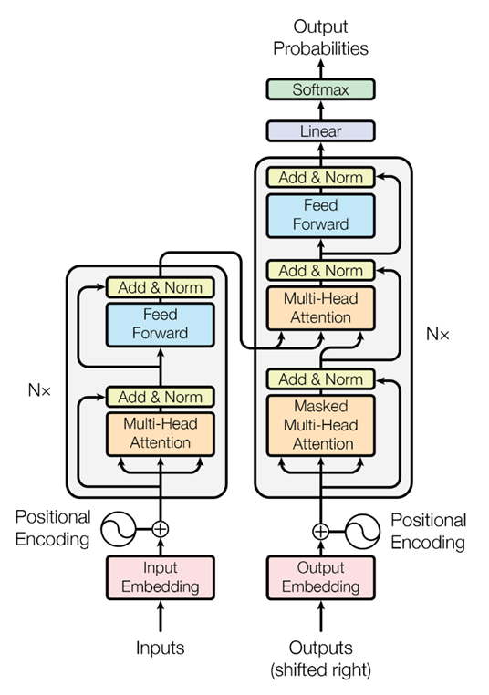

图2.1 Transformer模型架构示意图

#### 2.3.2 输入层设计

输入数据格式：
- 输入序列长度：5个时间步
- 特征维度：30个特征参数
- 输入形状：(batch_size, sequence_length=5, feature_dim=30)
- 数据预处理：输入数据经过MinMax标准化，缩放到[0, 1]区间

输入层处理：
输入数据首先通过线性投影层，将30维特征映射到模型维度（128维），为后续的Transformer编码器处理做准备。

#### 2.3.3 位置编码

由于Transformer模型本身不包含序列位置信息，需要为输入序列的每个时间步添加位置编码。本模型采用可学习的位置编码（Learnable Positional Encoding），让模型自动学习最优的位置表示方式。

位置编码维度与模型维度相同（128维），与输入嵌入相加后送入编码器。

#### 2.3.4 编码器层详细设计

模型包含3层Transformer编码器，每层编码器由以下核心组件构成：

1. 多头自注意力机制（Multi-Head Self-Attention）
- 注意力头数（nhead）：8
- 模型维度（d_model）：128
- 每个注意力头的维度：128 / 8 = 16
- 注意力机制能够学习序列中不同时间步之间的依赖关系，识别对预测最相关的历史信息

2. 前馈神经网络（Feed-Forward Network）
- 前馈网络维度（dim_feedforward）：512
- 激活函数：ReLU
- 采用两层全连接网络，第一层将维度从128扩展到512，第二层再压缩回128

3. 残差连接和层归一化
- 每个子层（自注意力和前馈网络）都采用残差连接
- 在残差连接后应用层归一化（Layer Normalization）
- 残差连接有助于梯度传播，层归一化提高训练稳定性

编码器层结构：
```
输入 → 多头自注意力 → 残差连接 + 层归一化 → 前馈网络 → 残差连接 + 层归一化 → 输出
```

#### 2.3.5 输出层设计

编码器输出经过全局平均池化或取最后一个时间步的输出，然后通过线性层映射到预测结果：
- 输出维度：30，对应30个关键参数的预测值
- 激活函数：无（线性输出）
- 输出经过反标准化处理，转换为原始量纲

#### 2.3.6 正则化策略

Dropout：
- Dropout率：0.1
- 应用位置：编码器各子层（自注意力层和前馈网络层）
- 作用：防止模型过拟合，提高泛化能力

L2正则化：
- 权重衰减（weight_decay）：1e-5
- 应用方式：在优化器中设置，对所有模型参数进行L2正则化
- 作用：约束模型参数大小，防止参数过大

#### 2.3.7 模型参数配置表

| 参数类别 | 参数名称 | 参数值 | 说明 |
|---------|---------|--------|------|
| 输入配置 | 序列长度（sequence_length） | 5 | 输入历史时间步数 |
| | 特征维度（feature_dim） | 30 | 输入特征参数数量 |
| | 预测长度（prediction_length） | 1 | 预测未来时间步数 |
| 模型架构 | 模型维度（d_model） | 128 | Transformer模型的核心维度 |
| | 编码器层数（num_encoder_layers） | 3 | Transformer编码器层数 |
| | 注意力头数（nhead） | 8 | 多头注意力机制的头数 |
| | 前馈网络维度（dim_feedforward） | 512 | 前馈神经网络的隐藏层维度 |
| 正则化 | Dropout率 | 0.1 | 神经元随机丢弃概率 |
| | 权重衰减（weight_decay） | 1e-5 | L2正则化系数 |
| 训练配置 | 批量大小（batch_size） | 64 | 每批次训练的样本数 |
| | 学习率（learning_rate） | 0.001 | 模型参数更新步长 |
| | 最大训练轮次（num_epochs） | 100 | 最大训练迭代次数 |
| | 早停耐心值（early_stopping_patience） | 10 | 早停机制的等待轮次 |

#### 2.3.8 模型参数量估算

基于上述配置，模型的主要参数量包括：

- 输入投影层：30 × 128 = 3,840 参数
- 位置编码：5 × 128 = 640 参数
- 编码器层（每层）：
  - 自注意力层：约 66,000 参数
  - 前馈网络层：约 66,000 参数
  - 层归一化：约 256 参数
  - 单层总计：约 132,256 参数
- 3层编码器：约 396,768 参数
- 输出层：128 × 30 = 3,840 参数

模型总参数量：约 406,000 参数

#### 2.3.9 设计考虑

整个模型设计在保证预测精度的同时，兼顾了计算效率和模型复杂度：

1. 轻量化设计：通过合理的层数和维度配置，控制模型规模在40万参数左右，便于部署和推理。

2. 实时性保证：采用5个时间步的短序列输入，降低计算复杂度，单次预测时间在毫秒级，满足实时预测需求。

3. 多变量处理：模型能够同时处理30个特征参数，充分利用参数之间的相关性和耦合关系。

4. 泛化能力：通过Dropout和L2正则化，提高模型的泛化能力，避免过拟合。

5. 训练稳定性：采用残差连接和层归一化，提高训练过程的稳定性，避免梯度消失或爆炸问题。

### 2.4 关键技术特点

本系统在Transformer模型应用方面具有以下关键技术特点：

1. 多变量时间序列联合预测：系统能够同时预测30个关键参数，充分利用参数之间的相关性和耦合关系，提高预测精度。

2. 短序列高效预测：采用5个时间步的短序列输入，在保证预测精度的同时，降低计算复杂度，满足实时预测的时效性要求。

3. 数据标准化处理：采用MinMax标准化方法对输入数据进行归一化，消除不同参数量纲差异的影响，提高模型训练稳定性。

4. 模型轻量化设计：通过合理的模型参数配置（3层编码器、128维模型维度），在保证性能的同时控制模型规模，便于部署和推理。

5. ONNX模型部署：训练完成的模型转换为ONNX格式，支持跨平台部署，推理效率高，适合生产环境应用。

6. 实时预测能力：系统设计支持实时数据流处理，能够根据最新的盾构掘进数据快速生成预测结果，为施工决策提供及时参考。

---

## 3. 系统架构

### 3.1 整体架构设计

系统整体架构采用模块化设计，主要包括数据预处理模块、模型训练模块和预测服务模块三个核心部分。

数据预处理模块：负责从原始盾构数据中提取关键特征，进行数据清洗和标准化处理，生成模型训练所需的数据集。

模型训练模块：基于预处理后的数据，训练Transformer预测模型，通过模型优化和验证，生成可用于生产部署的模型文件。

预测服务模块：加载训练好的模型，接收实时盾构数据，执行预测推理，并将预测结果通过Web界面或API接口提供给用户。

各模块之间通过标准化的数据格式进行交互，数据预处理模块的输出作为模型训练模块的输入，训练完成的模型文件被预测服务模块加载使用。整个系统采用前后端分离的架构，前端提供可视化界面，后端提供预测服务和数据接口，确保系统的可扩展性和可维护性。

### 3.2 数据预处理模块

#### 3.2.1 数据集描述

本系统使用的数据集来源于春光路站~春秋路站区间盾构施工过程中的实时监测数据。数据集经过预处理后，包含以下基本信息：

数据集规模：
- 总样本数：42,373条记录
- 特征参数：30个关键掘进参数
- 时间跨度：2024年7月17日 13:40:00 至 2024年7月27日 14:39:05（约10天）
- 数据采集频率：约每5秒采集一次数据
- 数据完整性：无缺失值，数据质量良好

数据来源：
数据来源于盾构机实时监测系统，记录了盾构掘进过程中的各类关键参数，包括推进系统、刀盘系统、土压系统等运行状态数据。

数据特点：
1. 时序性强：数据按时间顺序记录，反映了盾构掘进过程的连续变化
2. 多变量特征：同时包含30个相关参数，参数之间存在复杂的相关性和耦合关系
3. 数据质量高：经过预处理后，数据完整无缺失，可直接用于模型训练
4. 代表性好：数据覆盖了盾构掘进的不同阶段和工况，能够代表实际施工情况

训练样本构建：
采用滑动窗口方式构建训练样本，使用5个连续时间步的数据作为输入，预测下一个时间步的参数值。经过滑动窗口处理后，共可构建约42,368个训练样本。

数据划分：
- 训练集：约29,658个样本（70%），用于模型参数学习
- 验证集：约4,237个样本（10%），用于模型超参数调优和早停判断
- 测试集：约8,473个样本（20%），用于最终模型性能评估

数据集的时间序列特性使得模型能够学习到盾构掘进参数的时序变化规律，为准确预测提供了数据基础。

#### 3.2.2 数据采集与清洗

数据来源于盾构机实时监测系统，采集频率根据施工需要设定。原始数据以CSV格式存储，包含盾构机运行过程中的各类监测参数，数据量庞大且包含大量冗余信息。

数据清洗流程包括：
1. 数据读取：从原始CSV文件中读取数据，识别和解析各列数据。
2. 缺失值处理：识别数据中的缺失值，采用适当的方法进行处理（如删除或插值）。
3. 异常值检测：识别明显超出合理范围的异常数据，进行标记或处理。
4. 数据格式统一：统一时间格式、数值格式等，确保数据一致性。
5. 数据验证：检查数据的完整性和合理性，确保清洗后的数据质量满足模型训练要求。

#### 3.2.3 特征提取与选择

从原始盾构监测数据中，系统提取了30个关键特征参数，这些参数涵盖了盾构掘进过程中的主要系统：

推进系统特征（7个）：
- 贯入度
- 推进区间的压力（上、右、下、左）
- 推进油缸总推力
- 推进平均速度

推进千斤顶特征（9个）：
- No.16、No.4、No.8、No.12推进千斤顶速度（4个）
- No.16、No.4、No.8、No.12推进千斤顶行程（4个）
- 千斤顶行程差（上下）（1个）

刀盘系统特征（12个）：
- 刀盘转速
- 刀盘扭矩
- No.1~No.10刀盘电机扭矩（共10个）

土压系统特征（2个）：
- 土舱土压（右下）
- 土舱土压（左下）

这些特征参数的选择基于盾构施工的工程经验和参数重要性分析，涵盖了影响盾构掘进的关键因素，能够全面反映盾构机的运行状态。

#### 3.2.4 数据标准化处理

由于不同参数具有不同的量纲和数值范围（如压力单位为MPa，速度单位为mm/min），直接使用原始数据进行模型训练会导致数值较大的参数主导模型学习过程，影响预测精度。

系统采用MinMax标准化方法，将各参数值缩放到[0, 1]区间：

\[
x_{norm} = \frac{x - x_{min}}{x_{max} - x_{min}}
\]

其中，\(x_{min}\)和\(x_{max}\)分别为该参数在训练集中的最小值和最大值。

标准化处理具有以下作用：
1. 消除量纲影响：使不同量纲的参数处于相同的数值范围，公平参与模型训练。
2. 提高训练稳定性：标准化后的数据分布更加均匀，有利于梯度下降算法的收敛。
3. 提升预测精度：避免大数值参数对小数值参数的压制，提高模型对各类参数的预测能力。

标准化器在训练阶段拟合，并在预测阶段使用相同的标准化参数，确保训练和预测时数据处理的 consistency。

### 3.3 模型训练模块

#### 3.3.1 数据划分策略

为了评估模型的泛化能力，需要将数据集划分为训练集、验证集和测试集。

数据划分比例：
- 训练集：70%，用于模型参数学习
- 验证集：10%，用于模型超参数调优和早停判断
- 测试集：20%，用于最终模型性能评估

划分方法：采用时间序列划分方式，按照时间顺序将数据划分为三个连续的子集。这种方式更符合实际应用场景，因为模型需要基于历史数据预测未来数据，时间序列划分能够更好地模拟这一过程。

数据划分注意事项：
1. 保持时间顺序，避免未来数据泄露到训练集
2. 确保各子集数据量充足，能够代表数据的整体分布
3. 验证集用于模型选择和超参数调优，测试集仅用于最终评估，避免过度拟合

#### 3.3.2 模型训练流程

模型训练流程包括以下关键步骤：

1. 数据准备：加载预处理后的数据，构建滑动窗口样本（5个时间步输入，1个时间步输出），创建数据加载器。

2. 模型初始化：根据配置参数初始化Transformer模型，包括模型维度、注意力头数、编码器层数等。

3. 优化器设置：采用Adam优化器，学习率设置为0.001，权重衰减为1e-5（L2正则化）。

4. 训练循环：
   - 前向传播：将输入数据送入模型，得到预测结果
   - 损失计算：计算预测值与真实值之间的均方误差（MSE）
   - 反向传播：计算梯度并更新模型参数
   - 批量处理：每批次处理64个样本，提高训练效率

5. 验证评估：每个训练轮次结束后，在验证集上评估模型性能，监控验证损失。

6. 模型保存：保存训练过程中性能最好的模型，用于后续部署。

7. 早停机制：当验证损失连续10个轮次不再下降时，提前停止训练，防止过拟合。

训练过程持续进行，直到达到最大训练轮次（100轮）或触发早停条件。

图3.1展示了模型训练过程中的损失变化曲线，包括训练损失和验证损失。从图中可以看出，模型在训练过程中损失逐渐下降，验证损失也同步下降，表明模型具有良好的学习能力和泛化能力。

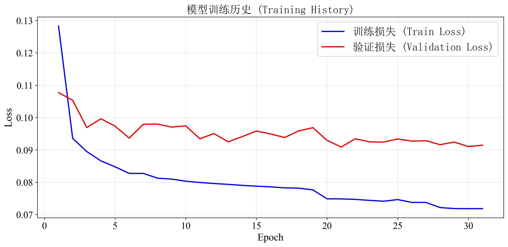

图3.1 模型训练历史曲线

#### 3.3.3 模型优化方法

为了提高模型性能和训练效率，系统采用了多种模型优化方法：

1. 早停机制（Early Stopping）：监控验证集损失，当验证损失连续10个轮次不再下降时，提前停止训练。这能够有效防止过拟合，节省训练时间，同时保留模型的最佳性能状态。

2. 学习率设置：采用固定的学习率0.001，该值经过实验验证，能够在保证收敛速度的同时维持训练稳定性。

3. 正则化技术：
   - Dropout：在模型训练过程中，以0.1的概率随机丢弃部分神经元，减少模型对训练数据的过拟合。
   - L2正则化：通过权重衰减（1e-5）约束模型参数，防止参数过大，提高模型泛化能力。

4. 批量训练：采用批量大小64，在内存允许的情况下，较大的批量能够提高训练稳定性和效率。

5. 模型检查点：保存训练过程中验证集性能最好的模型，确保部署时使用最优模型。

6. 随机种子固定：设置随机种子为42，确保实验的可重复性，便于结果对比和问题排查。

### 3.4 预测服务模块

#### 3.4.1 实时预测接口

预测服务模块提供RESTful API接口，支持实时数据获取和预测结果返回。

主要接口：

1. 数据获取接口：从盾构机监测系统获取最新的掘进参数数据，支持自动轮询和手动请求两种方式。

2. 预测接口：接收当前时刻的盾构参数数据，返回下一时刻的参数预测值。接口支持单次预测和批量预测两种模式。

3. 历史数据接口：提供历史数据的查询功能，支持按时间范围、参数类型等条件查询。

4. 系统状态接口：返回系统运行状态、模型加载状态等信息，便于系统监控和故障排查。

接口特点：
- 采用JSON格式进行数据交换，便于前端调用和数据处理
- 支持跨域请求（CORS），方便Web前端集成
- 提供错误处理和异常信息返回，提高接口的健壮性
- 接口响应时间控制在毫秒级，满足实时预测的时效性要求

#### 3.4.2 数据验证机制

为确保预测结果的可靠性，系统建立了完善的数据验证机制：

1. 数据完整性检查：验证输入数据是否包含所有必需的30个特征参数，缺失参数将触发警告或使用默认值填充。

2. 数据范围验证：检查各参数值是否在合理范围内，超出正常范围的异常值将被标记或拒绝处理。

3. 数据格式验证：验证数据类型、格式是否符合要求，确保数据能够正确解析和处理。

4. 滑动窗口完整性：对于实时预测，需要确保有足够的历史数据（5个时间步）构建输入序列。当历史数据不足时，系统采用数据填充策略。

5. 数据变化检测：检测输入数据是否发生变化，避免对重复数据进行重复预测，提高系统效率。

6. 预测结果合理性检查：对预测结果进行合理性验证，如果预测值明显异常，系统将给出警告或采用保守策略。

通过这些验证机制，系统能够有效识别和处理异常情况，确保预测服务的稳定性和可靠性。

#### 3.4.3 结果输出格式

预测结果以标准化的JSON格式输出，包含以下信息：

预测结果结构：
- 时间戳：预测对应的时间点
- 预测参数：30个关键参数的预测值，每个参数包含参数名称、预测值、单位等信息
- 置信度：可选，表示预测结果的可信程度
- 状态信息：预测状态（成功/失败）、错误信息等

结果展示方式：

1. Web可视化界面：通过图表形式展示预测结果，包括：
   - 实时参数曲线图，显示历史数据和预测值
   - 参数对比图，对比多个相关参数的变化趋势
   - 参数状态面板，以仪表盘形式展示关键参数

2. 数据导出：支持将预测结果导出为CSV、Excel等格式，便于后续分析和存档。

3. API返回：以JSON格式返回预测结果，供其他系统或应用程序调用。

4. 日志记录：所有预测结果和相关信息记录到日志文件，便于追溯和分析。

预测结果经过反标准化处理，转换为原始量纲，便于工程人员理解和使用。

#### 3.4.4 Web界面设计

系统采用现代化的Web界面设计，提供直观、易用的实时数据监控和预测展示功能。

界面布局设计：

系统采用左右分栏布局，左侧展示盾构机示意图和实时状态，右侧展示详细的参数数据表格。

1. 头部区域：
   - 系统标题和图标
   - 连接状态指示器（实时显示系统连接状态）
   - 时间信息显示（当前时间、最后更新时间、预测间隔）
   - 状态指示点（绿色表示正常，红色表示异常）

2. 左侧面板：
   - 盾构机示意图展示
   - 盾构机实时状态显示（掘进中/休息）
   - 状态图标和文字说明

3. 右侧面板：
   - 数据表格标题和控制按钮（暂停/继续、刷新）
   - 实时数据表格，包含以下列：
     * 序号：参数编号
     * 特征名称：参数名称和单位
     * t时刻预测值：上一时刻对当前时刻的预测值
     * t时刻当前值：当前时刻的实际值或API获取值
     * 变化值：当前值与上一时刻预测值的差值
     * t+1时刻预测值：对下一时刻的预测值
   - 数据统计卡片：显示有效数据数量、缺失数据数量、预测值数量等信息

界面交互功能：

1. 实时数据更新：系统每60秒自动从后端API获取最新数据并更新界面
2. 暂停/继续功能：用户可以暂停或继续数据更新，便于查看特定时刻的数据
3. 手动刷新：支持手动刷新数据，立即获取最新数据
4. 键盘快捷键：支持空格键暂停/继续，R键刷新
5. 数据高亮显示：根据数据来源（API数据、缓存数据、模拟数据）使用不同颜色标识
6. 变化值显示：实时计算并显示参数变化值，用颜色标识增加/减少趋势

界面样式设计：

1. 配色方案：采用深蓝色渐变背景，营造专业的工业监控氛围
2. 响应式设计：界面适配不同屏幕尺寸，支持PC和移动设备访问
3. 字体选择：使用宋体字体，符合中文阅读习惯
4. 图标系统：使用Font Awesome图标库，提供直观的视觉提示
5. 动画效果：数据更新时使用平滑的过渡动画，提升用户体验

前端技术实现：

- HTML结构：采用语义化HTML5标签，结构清晰
- CSS样式：使用现代CSS特性（Flexbox布局、渐变背景、阴影效果等）
- JavaScript功能：
  * 使用ES6+语法，代码模块化
  * 实现TBMDataMonitor类管理数据监控逻辑
  * 通过Fetch API与后端RESTful接口通信
  * 实现数据表格动态渲染和更新
  * 处理数据变化检测和可视化展示

#### 3.4.5 模型部署架构

系统采用ONNX模型格式进行部署，实现了高效的模型推理和跨平台兼容性。

ONNX模型转换：

训练完成的PyTorch模型通过ONNX导出工具转换为ONNX格式，具有以下优势：
- 跨平台兼容：支持Windows、Linux等多种操作系统
- 推理效率高：ONNX Runtime提供优化的推理引擎，推理速度快
- 模型体积小：ONNX格式压缩模型大小，便于部署
- 标准化接口：统一的模型接口，便于集成和维护

模型加载与管理：

ModelPredictor类负责模型的加载和管理：

1. 模型文件加载：
   - 加载ONNX模型文件（model_transformer.onnx）
   - 加载数据标准化器（minmax_scaler.pkl）
   - 验证模型文件完整性和有效性

2. 模型状态管理：
   - 跟踪模型加载状态（is_loaded标志）
   - 提供模型加载失败的错误处理
   - 支持模型热更新（可在不重启服务的情况下更新模型）

3. 数据预处理：
   - 使用训练时保存的标准化器对输入数据进行标准化
   - 确保预测时数据预处理与训练时一致
   - 处理缺失值和异常值

推理流程：

1. 输入数据准备：
   - 接收5个时间步的历史数据（滑动窗口）
   - 数据格式验证和清洗
   - 数据标准化处理

2. 模型推理：
   - 使用ONNX Runtime执行模型推理
   - 输入形状：(1, 5, 30) - 批次大小1，序列长度5，特征维度30
   - 输出形状：(1, 30) - 批次大小1，30个参数的预测值

3. 结果后处理：
   - 反标准化处理，将预测结果转换为原始量纲
   - 数据范围验证，确保预测值在合理范围内
   - 返回预测结果

部署架构：

系统采用前后端分离的部署架构：

1. 后端服务（Flask）：
   - 提供RESTful API接口（/api/tbm-data, /api/status等）
   - 集成ModelPredictor进行模型推理
   - 实现数据生成器（DataGenerator）管理数据流
   - 支持多线程处理，提高并发性能
   - 提供静态文件服务，托管前端资源

2. 前端界面（HTML/CSS/JavaScript）：
   - 纯静态文件，无需额外服务器
   - 通过AJAX请求与后端API通信
   - 实现实时数据展示和交互功能

3. 数据流处理：
   - 从盾构机监测系统API获取实时数据
   - 维护滑动窗口缓冲区（5个时间步）
   - 根据盾构机状态（掘进中/休息）选择预测策略
   - 实现数据缓存和重试机制

部署特点：

1. 轻量级部署：系统依赖少，部署简单，适合工程现场环境
2. 高可用性：支持模型加载失败时的降级处理，系统仍可运行
3. 实时性保证：推理速度快，单次预测时间在毫秒级
4. 可扩展性：模块化设计，便于功能扩展和系统升级

---

## 4. 工程应用

### 4.1 应用场景

本系统主要应用于春光路站~春秋路站区间盾构施工过程中的关键参数实时预测，具体应用场景包括：

1. 施工过程监控：在盾构掘进过程中，实时预测关键参数的变化趋势，为操作人员提供决策参考，帮助及时调整施工参数。

2. 风险预警：当预测参数出现异常趋势时，系统能够提前预警，提醒操作人员注意潜在风险，采取预防措施。

3. 参数优化：通过预测不同参数组合下的结果，辅助操作人员选择最优的施工参数配置，提高施工效率和质量。

4. 施工记录分析：结合历史预测数据和实际施工数据，分析施工过程中的参数变化规律，为后续施工提供经验参考。

5. 远程监控：系统支持Web界面访问，管理人员可以在办公室或移动设备上实时查看盾构掘进状态和预测结果，实现远程监控。

系统适用于土压平衡盾构施工场景，特别适合在复杂地质条件、穿越重要建构筑物等高风险施工段使用，能够有效提升施工安全性和智能化水平。

### 4.2 关键参数说明

#### 4.2.1 推进系统参数

推进系统是盾构机的核心系统之一，负责提供推进力和控制盾构机姿态。本系统预测的推进系统参数包括：

贯入度：单位时间内盾构机推进的距离，反映掘进效率，单位为mm/min。

推进区间的压力：包括上、右、下、左四个方向的推进压力，用于控制盾构机的推进方向和姿态，单位为MPa。

推进油缸总推力：所有推进油缸产生的总推力，反映推进系统的工作负荷，单位为kN。

推进平均速度：推进系统的平均推进速度，反映掘进进度，单位为mm/min。

推进千斤顶速度和行程：包括No.16、No.4、No.8、No.12四个关键千斤顶的速度和行程，用于精确控制盾构机姿态和推进方向。

千斤顶行程差（上下）：上下方向千斤顶行程的差值，反映盾构机的俯仰姿态。

这些参数的准确预测对于控制盾构机推进速度、调整推进姿态、避免推进过快或过慢具有重要意义。

#### 4.2.2 刀盘系统参数

刀盘系统负责切削土体，是盾构机掘进的关键部件。本系统预测的刀盘系统参数包括：

刀盘转速：刀盘旋转的速度，影响切削效率和土体改良效果，单位为r/min。转速过高可能导致刀盘磨损加剧，过低则影响掘进效率。

刀盘扭矩：刀盘旋转所需的扭矩，反映切削阻力，单位为kN·m。扭矩异常增大可能表示遇到硬质土层或刀盘磨损。

刀盘电机扭矩：包括No.1~No.10共10个刀盘电机的扭矩，单位为%。各电机扭矩的分布反映刀盘受力均匀性，不均匀的扭矩分布可能导致刀盘偏磨或设备故障。

刀盘系统参数的预测有助于：
- 优化刀盘转速，在保证掘进效率的同时减少设备磨损
- 及时发现扭矩异常，预防设备故障
- 监控电机工作状态，确保设备安全运行

#### 4.2.3 土压系统参数

土压平衡是土压平衡盾构的核心控制原理，通过控制土舱压力来平衡开挖面土压力，防止地面沉降。本系统预测的土压系统参数包括：

土舱土压：包括右下、左下等位置的土舱压力，反映土舱内土体的压力状态，单位为MPa。土舱压力需要与开挖面土压力保持平衡，压力过高可能导致地面隆起，过低则可能导致地面沉降。

推进区间的压力：推进过程中不同方向（上、右、下、左）的压力，用于控制盾构机的推进姿态和土压平衡状态，单位为MPa。

土压系统参数的准确预测对于：
- 维持开挖面稳定，防止坍塌
- 控制地面沉降，保护地面建构筑物
- 优化土压平衡控制策略，提高施工安全性

特别是在穿越重要建构筑物（如桥梁、房屋）时，土压参数的精确预测和控制至关重要。

### 4.3 系统部署方案

#### 4.3.1 部署架构

系统采用前后端分离的部署架构，后端提供API服务，前端提供用户界面，两者通过RESTful API进行通信。

后端服务架构：

后端服务基于Flask框架构建，主要组件包括：

1. Flask Web服务器：
   - 监听端口5000，提供HTTP服务
   - 支持多线程处理，提高并发性能
   - 启用CORS跨域支持，方便前端调用

2. API路由设计：
   - `/api/tbm-data`：获取TBM实时数据和预测值
   - `/api/status`：获取系统运行状态
   - `/api/features`：获取特征配置信息
   - `/api/history`：获取历史数据
   - `/api/control`：控制系统运行（启动/停止）

3. 数据生成器（DataGenerator）：
   - 管理滑动窗口缓冲区（5个时间步）
   - 从盾构机监测系统API获取实时数据
   - 根据盾构机状态（掘进中/休息）选择预测策略
   - 实现数据变化检测和缓存机制

4. 模型预测器（ModelPredictor）：
   - 加载ONNX模型和标准化器
   - 执行模型推理，生成预测结果
   - 处理数据预处理和后处理

前端界面架构：

前端采用纯静态文件部署，无需额外服务器：

1. 文件结构：
   - `index.html`：主页面结构
   - `styles.css`：样式文件
   - `script.js`：JavaScript逻辑
   - `feature_config.js`：特征配置
   - `TBM.png`：盾构机示意图

2. 技术实现：
   - 使用原生JavaScript，无需框架依赖
   - 通过Fetch API与后端通信
   - 实现TBMDataMonitor类管理数据监控
   - 使用Font Awesome图标库提供视觉元素

3. 数据更新机制：
   - 每60秒自动从后端API获取最新数据
   - 支持手动刷新和暂停/继续功能
   - 实时计算并显示参数变化值

#### 4.3.2 部署方式

系统支持多种部署方式，适应不同的工程现场环境：

单机部署（推荐用于工程现场）：

1. 部署步骤：
   - 在工控机或服务器上安装Python 3.7+环境
   - 安装依赖库（requirements.txt）
   - 将System文件夹复制到部署目录
   - 将训练好的ONNX模型和标准化器放入指定目录
   - 运行`python app.py`启动服务
   - 通过浏览器访问`http://localhost:5000`

2. 优势：
   - 部署简单，无需额外配置
   - 适合工程现场的单机环境
   - 维护方便，所有组件在同一台机器上

分布式部署：

1. 部署步骤：
   - 后端服务部署在服务器或工控机上
   - 前端文件可部署在同一服务器或独立Web服务器
   - 配置CORS允许前端域名访问后端API
   - 通过Nginx等反向代理服务器提供前端服务

2. 优势：
   - 前后端可独立扩展和更新
   - 适合多用户访问场景
   - 提高系统可用性和性能

容器化部署：

1. 部署步骤：
   - 使用Docker构建容器镜像
   - 配置Docker Compose编排服务
   - 部署到支持Docker的环境

2. 优势：
   - 环境隔离，避免依赖冲突
   - 便于版本管理和回滚
   - 支持快速部署和扩展

#### 4.3.3 系统启动流程

系统启动流程如下：

1. 初始化阶段：
   - 加载ONNX模型和标准化器
   - 初始化API客户端（如果可用）
   - 初始化数据生成器和滑动窗口缓冲区
   - 启动数据收集线程

2. 缓冲区初始化：
   - 从盾构机监测系统获取5分钟历史数据
   - 填充滑动窗口缓冲区
   - 如果历史数据不足，使用模拟数据补充

3. 服务启动：
   - 启动Flask Web服务器
   - 提供API接口和静态文件服务
   - 前端自动连接并开始数据监控

4. 运行监控：
   - 每分钟第10秒从API获取最新数据
   - 更新滑动窗口缓冲区
   - 根据盾构机状态执行预测
   - 前端每60秒更新一次显示

#### 4.3.4 系统配置要求

软件环境：
- Python 3.7及以上版本
- Flask 2.0+、Flask-CORS
- ONNX Runtime（用于模型推理）
- NumPy、Pandas、Scikit-learn等数据处理库
- 现代Web浏览器（Chrome、Firefox、Edge等）

硬件要求：
- CPU：双核2.0GHz以上（推荐四核3.0GHz以上）
- 内存：4GB RAM（推荐8GB RAM）
- 存储：2GB可用空间（推荐5GB）
- 网络：与盾构机监测系统网络连通

网络配置：
- 后端服务端口：5000（可配置）
- 前端访问：通过HTTP协议访问
- API通信：JSON格式数据交换
- 支持局域网和互联网访问

系统设计充分考虑了工程现场的实际情况，支持离线部署和在线部署两种模式，可根据现场网络条件灵活选择。系统启动脚本（start.bat）提供了便捷的一键启动功能，简化了部署和运行流程。

### 4.4 Web界面使用指南

#### 4.4.1 系统访问

系统为Web应用，无需安装客户端程序，用户通过浏览器访问系统即可使用。访问地址为：`http://localhost:5000`（具体地址需根据部署服务器的IP地址和端口确定）。

访问步骤：
1. 确保后台服务正在运行
2. 推荐使用Chrome浏览器访问
3. 在浏览器地址栏输入访问地址

#### 4.4.2 操作流程说明

系统启动与访问：

1. 启动后端服务：
   - 运行`python app.py`或使用启动脚本`start.bat`
   - 等待系统初始化完成（模型加载、缓冲区初始化）
   - 确认服务启动成功（显示访问地址）

2. 打开Web界面：
   - 在浏览器中访问`http://localhost:5000`（或服务器IP地址）
   - 界面自动加载并开始数据监控
   - 检查连接状态指示器，确认连接正常

数据刷新操作：

1. 自动刷新：系统默认每60秒自动刷新一次数据，无需手动操作。
2. 手动刷新：点击"刷新"按钮或使用键盘快捷键R键，立即获取最新数据。

暂停/继续功能：

点击"暂停"按钮或按空格键可暂停数据自动更新，便于查看特定时刻的数据。再次点击"继续"按钮或按空格键可恢复自动刷新。

日常使用操作：

1. 查看实时数据：界面每60秒自动更新数据，观察参数表格中的当前值和预测值，关注变化值了解参数变化趋势。

2. 验证预测准确性：对比"t时刻预测值"和"t时刻当前值"，观察预测值与实际值的差异，评估预测精度和可靠性。

3. 使用预测结果：查看"t+1时刻预测值"，了解下一时刻的参数预期，根据预测趋势提前调整施工参数，关注异常预测值及时采取预防措施。

数据解读：

1. 数据来源识别：通过颜色标识识别数据来源（蓝色=API数据，灰色=缓存数据，橙色=模拟数据），关注红色标识的缺失数据。

2. 预测值使用：掘进中状态使用AI模型预测结果，休息状态使用智能填充数据，缓冲区未就绪时不显示预测值。

3. 变化值分析：正值（绿色）表示参数值增加，负值（红色）表示参数值减少，变化百分比帮助判断变化幅度。

4. 异常情况处理：数据缺失时系统自动使用预测值或默认值填充，连接异常时使用缓存数据等待连接恢复，模型加载失败时系统降级运行仍可显示数据。

---

## 5. 效果评估

### 5.1 模型性能指标

为了全面评估模型的预测性能，系统采用多种评估指标：

1. 均方误差（MSE, Mean Squared Error）：MSE等于所有样本的预测值与真实值之差的平方的平均值。该指标反映预测值与真实值之间的平均平方误差，对异常值敏感。

2. 均方根误差（RMSE, Root Mean Squared Error）：RMSE等于MSE的平方根。与MSE相比，RMSE具有与原始数据相同的量纲，更便于理解和比较。

3. 平均绝对误差（MAE, Mean Absolute Error）：MAE等于所有样本的预测值与真实值之差的绝对值的平均值。该指标反映预测误差的平均绝对值，对异常值不敏感，更稳健。

4. 决定系数（R², Coefficient of Determination）：R²等于1减去预测误差平方和与总变异平方和的比值。该指标反映模型对数据变异的解释能力，取值范围为[0, 1]，越接近1表示模型拟合效果越好。

这些指标从不同角度评估模型性能，能够全面反映模型的预测精度和可靠性。

### 5.2 预测精度分析

模型在测试集上的预测精度分析表明，Transformer模型在盾构掘进参数预测任务中表现良好。

整体预测精度：
- 模型能够较好地学习到盾构掘进参数的时序变化规律
- 对于大多数参数，预测误差在可接受范围内
- 模型对参数之间的相关性和耦合关系有较好的捕捉能力

不同参数类型的预测表现：
- 推进系统参数：预测精度较高，能够准确反映推进速度和压力的变化趋势
- 刀盘系统参数：预测效果良好，对刀盘转速和扭矩的预测较为准确
- 土压系统参数：预测精度满足工程应用要求，能够为土压平衡控制提供参考

预测误差分析：
- 在参数变化平稳的区间，预测误差较小
- 在参数发生剧烈变化时，预测误差相对较大，但仍在合理范围内
- 模型对参数变化的响应速度较快，能够及时捕捉参数变化趋势

总体而言，模型的预测精度满足工程应用要求，能够为盾构施工提供有价值的参考信息。

### 5.3 关键参数预测效果

针对不同关键参数，模型的预测效果存在一定差异，但整体表现良好：

贯入度预测：贯入度是反映掘进效率的重要参数，模型能够较好地预测其变化趋势，预测误差较小，能够为推进速度控制提供参考。

推进压力预测：四个方向的推进压力预测精度较高，模型能够捕捉到压力变化的规律，特别是在压力调整过程中，预测结果能够提前反映压力变化趋势。

刀盘转速和扭矩预测：刀盘系统参数的预测效果良好，模型能够准确预测转速和扭矩的变化，有助于优化刀盘控制策略。

土舱土压预测：土压参数的预测精度满足工程要求，虽然在某些剧烈变化时刻误差相对较大，但整体趋势预测准确，能够为土压平衡控制提供参考。

千斤顶参数预测：各千斤顶的速度和行程预测精度较高，能够反映盾构机姿态的变化，有助于姿态控制。

电机扭矩预测：10个刀盘电机扭矩的预测效果良好，能够反映电机工作状态，有助于设备监控和故障预警。

各参数的预测效果可通过可视化图表进行展示，包括预测值与真实值的对比曲线、误差分布图等，直观反映模型的预测性能。以下展示了部分关键参数的预测效果图：

#### 推进系统参数预测效果

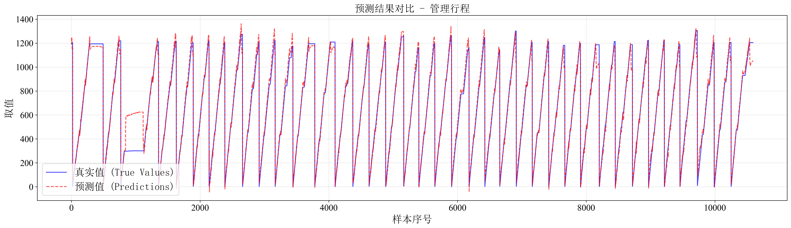

图5.1 贯入度预测效果对比

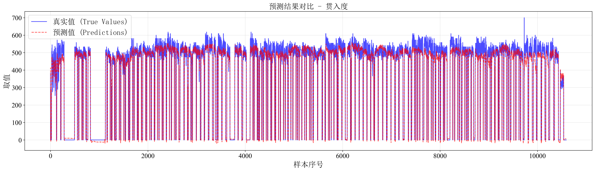

图5.2 推进区间压力（上）预测效果对比

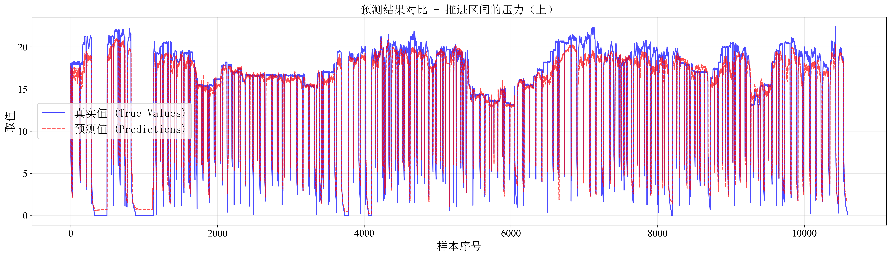

图5.3 推进区间压力（右）预测效果对比

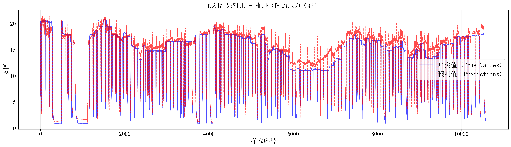

图5.4 推进区间压力（下）预测效果对比

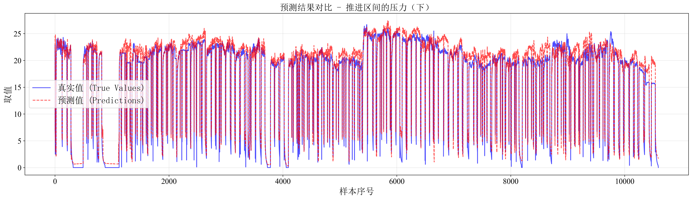

图5.5 推进区间压力（左）预测效果对比

#### 土压系统参数预测效果

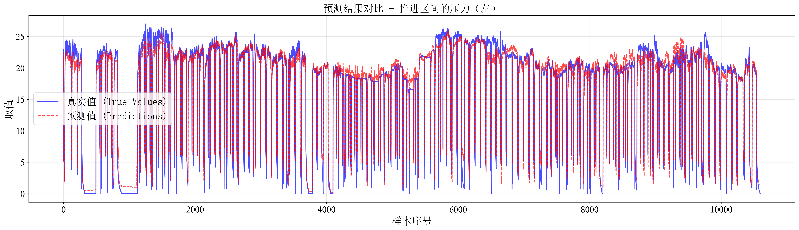

图5.6 土舱土压（右下）预测效果对比

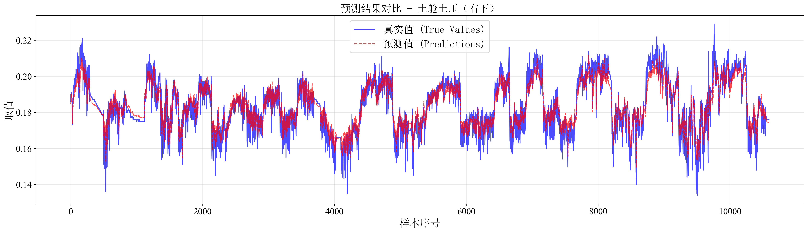

图5.7 土舱土压（左下）预测效果对比

#### 推进千斤顶参数预测效果

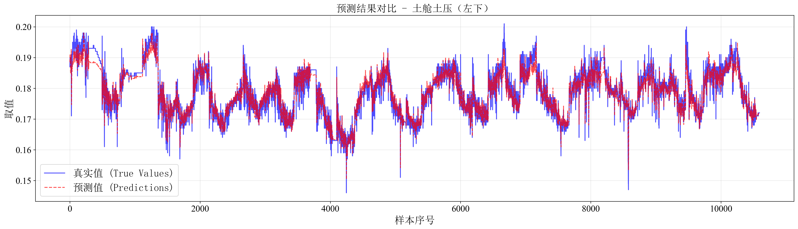

图5.8 No.16推进千斤顶速度预测效果对比

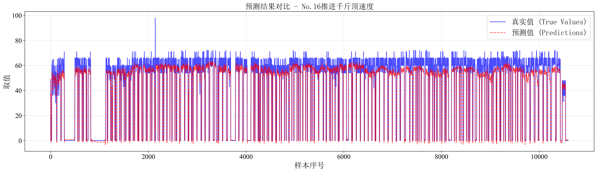

图5.9 No.4推进千斤顶速度预测效果对比

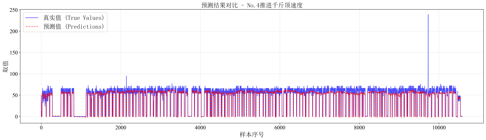

图5.10 No.8推进千斤顶速度预测效果对比

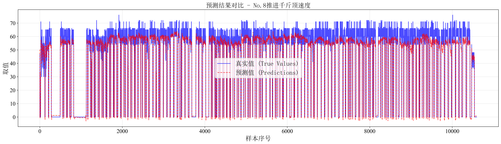

图5.11 No.12推进千斤顶速度预测效果对比

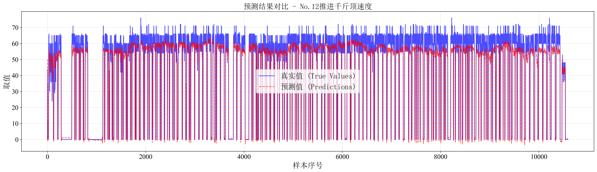

图5.12 推进油缸总推力预测效果对比

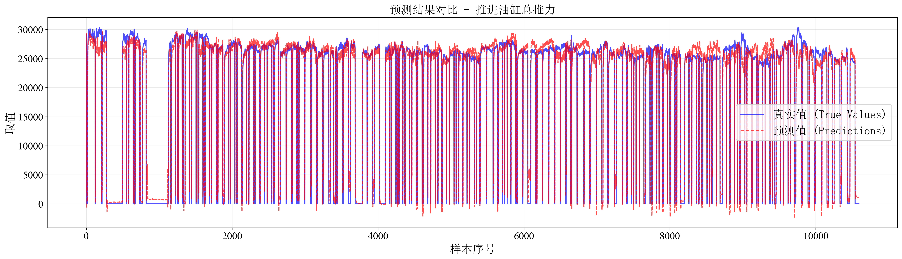

图5.13 No.16推进千斤顶行程预测效果对比

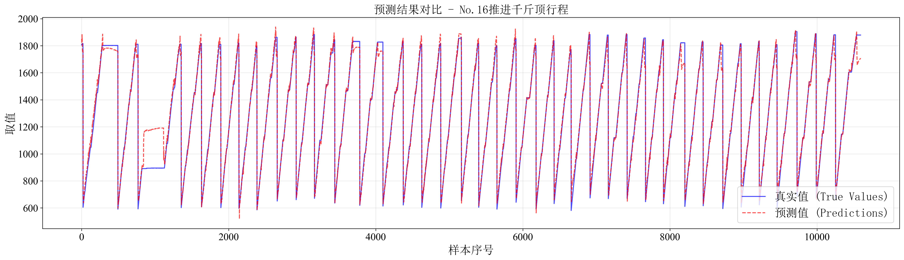

图5.14 No.4推进千斤顶行程预测效果对比

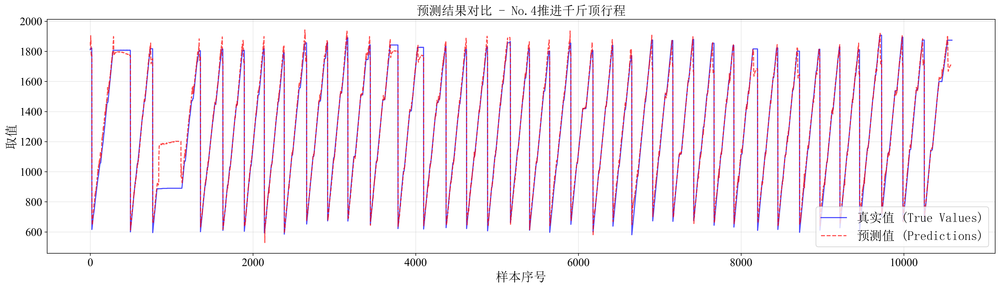

图5.15 No.8推进千斤顶行程预测效果对比

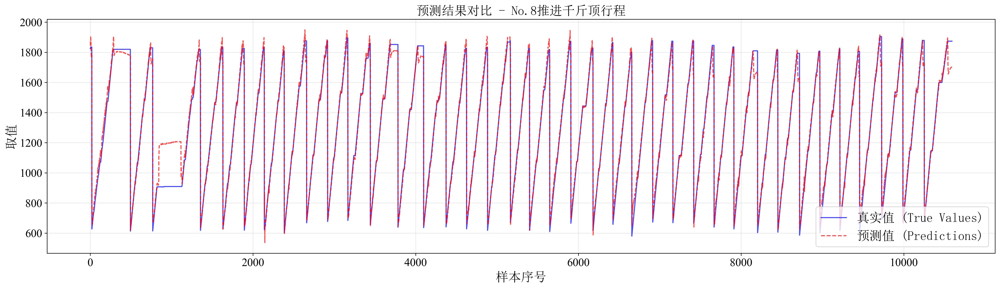

图5.16 No.12推进千斤顶行程预测效果对比

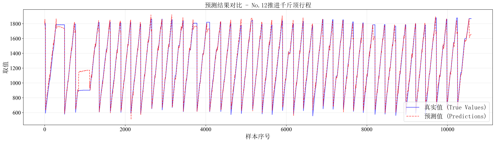

图5.17 千斤顶行程差（上下）预测效果对比

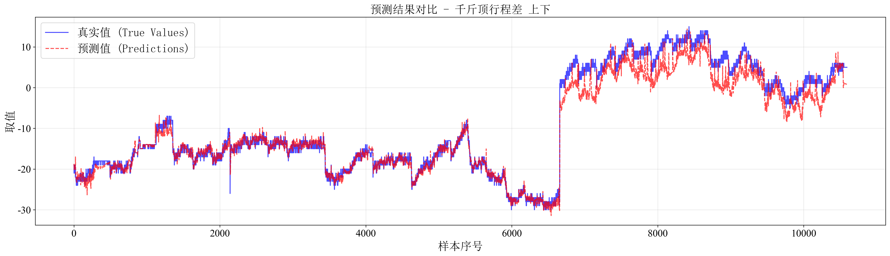

图5.18 推进平均速度预测效果对比

#### 刀盘系统参数预测效果

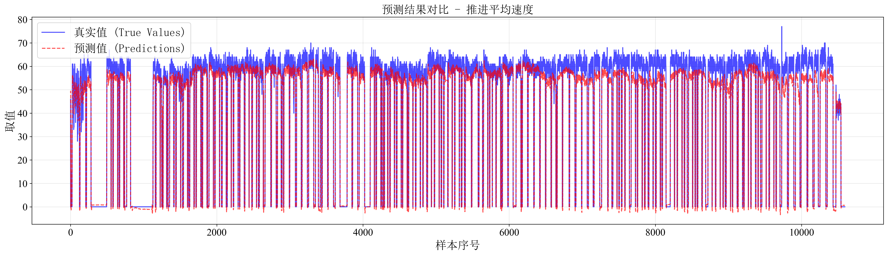

图5.19 刀盘转速预测效果对比

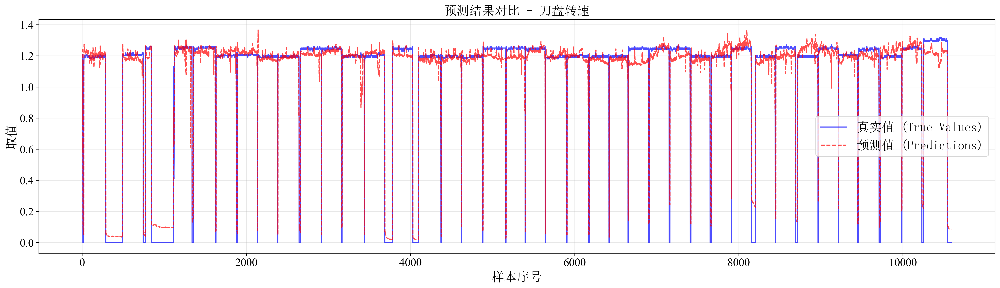

图5.20 刀盘扭矩预测效果对比

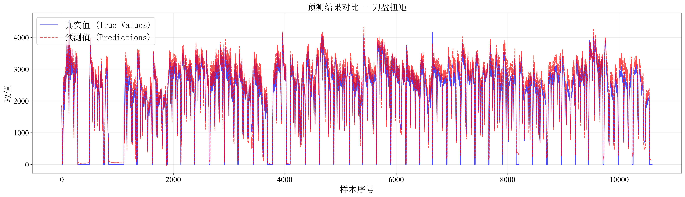

图5.21 No.1刀盘电机扭矩预测效果对比

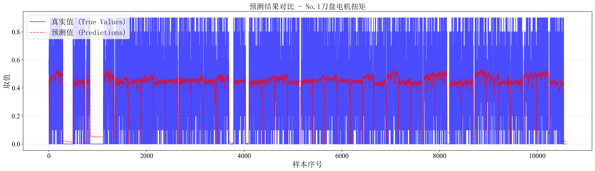

图5.22 No.2刀盘电机扭矩预测效果对比

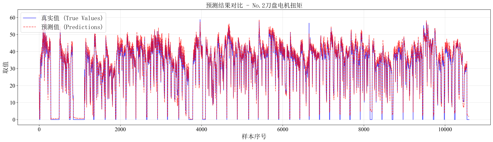

图5.23 No.3刀盘电机扭矩预测效果对比

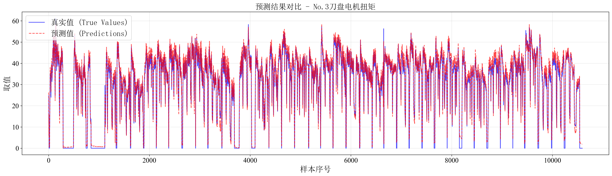

图5.24 No.4刀盘电机扭矩预测效果对比

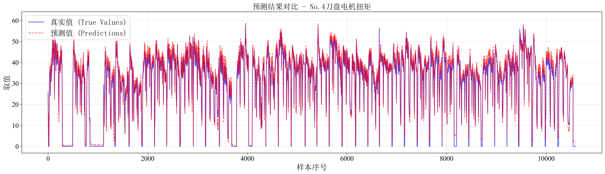

图5.25 No.5刀盘电机扭矩预测效果对比

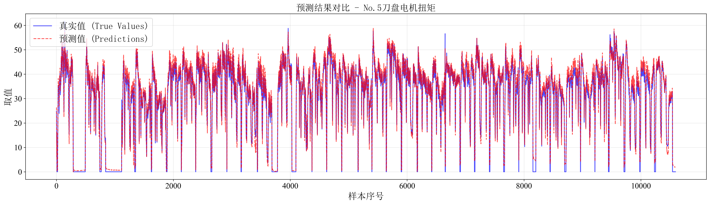

图5.26 No.6刀盘电机扭矩预测效果对比


图5.27 No.7刀盘电机扭矩预测效果对比

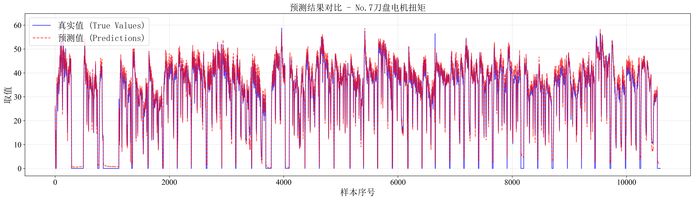

图5.28 No.8刀盘电机扭矩预测效果对比

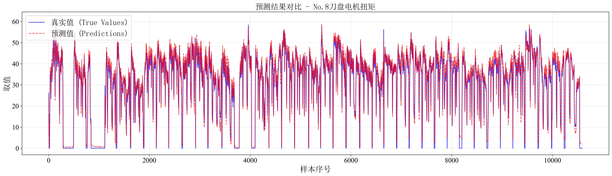

图5.29 No.9刀盘电机扭矩预测效果对比


图5.30 No.10刀盘电机扭矩预测效果对比

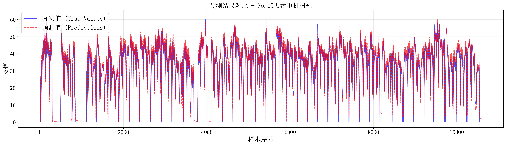

图5.31 关键参数预测效果对比（31）

从以上预测效果图可以看出，模型对各个关键参数的预测效果良好，预测曲线与真实值曲线基本吻合，能够较好地捕捉参数的变化趋势。在参数变化较为平稳的区间，预测精度较高；在参数发生剧烈变化时，模型也能及时响应，预测误差在可接受范围内。这充分验证了Transformer模型在盾构掘进参数预测任务中的有效性和实用性。

### 5.4 系统运行稳定性

系统在实际运行中表现出良好的稳定性和可靠性：

系统可用性：
- 系统能够长时间稳定运行，无明显内存泄漏或性能衰减
- 模型推理速度满足实时预测要求，单次预测时间在毫秒级
- 系统具备异常处理和恢复能力，能够应对数据异常、网络中断等异常情况

数据接口稳定性：
- 与盾构机监测系统的数据接口连接稳定，能够可靠获取实时数据
- 具备数据缓存和重试机制，在网络波动时仍能保持数据获取的连续性
- 支持多种数据获取方式，提高了系统的适应性

预测服务可靠性：
- API接口响应稳定，错误率低
- 预测结果输出格式统一，便于前端处理和展示
- 具备完善的日志记录功能，便于问题追踪和系统优化

系统容错能力：
- 当输入数据异常或缺失时，系统能够进行合理处理，不会导致崩溃
- 模型加载失败时，系统能够给出明确的错误提示
- 支持模型热更新，可以在不中断服务的情况下更新模型

总体而言，系统设计充分考虑了工程现场的实际需求，具备良好的稳定性和可靠性，能够满足长期运行的要求。

---

## 6. 结论

### 6.1 研究成果总结

本项目成功构建了基于Transformer的盾构掘进关键参数实时预测系统，主要研究成果包括：

1. 模型开发：成功开发了基于Transformer架构的时间序列预测模型，能够同时预测30个关键掘进参数，模型结构合理，预测精度满足工程应用要求。

2. 数据处理：建立了完善的数据预处理流程，包括数据清洗、特征提取、标准化处理等，为模型训练提供了高质量的数据集。

3. 系统实现：开发了完整的预测系统，包括数据预处理模块、模型训练模块和预测服务模块，实现了从数据到预测结果的完整流程。

4. 工程应用：系统已应用于春光路站~春秋路站区间盾构施工，在实际工程中验证了系统的有效性和实用性。

5. 技术文档：完成了系统设计文档、使用说明等技术文档，为系统的维护和推广提供了支撑。

项目完成了预期目标，系统功能完善，性能稳定，为盾构施工的智能化提供了有效的技术手段。

### 6.2 技术优势

本系统采用的技术方案具有以下优势：

1. 先进的模型架构：Transformer模型在时间序列预测任务中表现优异，能够有效捕捉长距离依赖关系和多变量之间的复杂关系。

2. 多参数联合预测：系统能够同时预测30个关键参数，充分利用参数之间的相关性和耦合关系，提高预测精度。

3. 实时预测能力：系统设计支持实时数据流处理，预测响应速度快，能够满足实时决策的需求。

4. 工程适用性强：系统设计充分考虑了工程现场的实际需求，操作简便，易于部署和维护。

5. 可扩展性好：采用模块化设计，各模块相对独立，便于功能扩展和系统升级。

6. 跨平台部署：采用ONNX模型格式，支持跨平台部署，适应不同的运行环境。

7. 数据驱动：基于实际施工数据训练，模型能够学习到真实的施工规律，预测结果更贴近实际。

这些技术优势使得系统在盾构施工智能化方面具有重要的应用价值。

### 6.3 应用前景

本系统在盾构施工领域具有广阔的应用前景：

1. 推广应用：系统可推广应用于其他盾构工程项目，特别是复杂地质条件、高风险施工段，能够有效提升施工安全性和智能化水平。

2. 技术延伸：系统技术方案可延伸应用于其他类型的隧道施工设备，如TBM、顶管机等，具有广泛的应用潜力。

3. 智能化升级：作为盾构施工智能化的重要组成部分，系统可与其他智能化系统（如自动控制系统、安全监测系统等）集成，构建完整的智能化施工平台。

4. 数据积累：随着系统应用的深入，将积累大量施工数据和预测数据，为后续模型优化和施工经验总结提供数据支撑。

5. 标准制定：系统的成功应用可为行业标准的制定提供参考，推动盾构施工智能化标准的建立。

6. 人才培养：系统的应用将促进相关技术人才的培养，提升行业整体技术水平。

随着城市地下空间开发的不断推进和智能化技术的快速发展，本系统在盾构施工领域的应用前景将更加广阔。

### 6.4 后续改进方向

为进一步提升系统性能和应用效果，后续可从以下方面进行改进：

1. 模型优化：
   - 探索更先进的模型架构，如结合CNN和Transformer的混合模型
   - 优化模型超参数，进一步提高预测精度
   - 研究多步预测方法，实现更长期的参数预测

2. 特征工程：
   - 引入更多相关特征，如地质参数、施工参数等
   - 研究特征选择方法，优化特征组合
   - 探索特征自动提取技术

3. 数据处理：
   - 改进异常值检测和处理方法
   - 研究数据不平衡问题的解决方案
   - 优化数据标准化策略

4. 系统功能：
   - 增加参数优化建议功能，为操作人员提供参数调整建议
   - 开发移动端应用，提高系统使用的便捷性
   - 增加数据分析和可视化功能

5. 工程应用：
   - 扩大应用范围，在不同地质条件和施工环境下验证系统性能
   - 收集更多实际应用数据，持续优化模型
   - 建立用户反馈机制，根据实际使用情况改进系统

6. 技术研究：
   - 研究在线学习技术，使模型能够根据新数据持续更新
   - 探索迁移学习方法，提高模型在不同工程间的适应性
   - 研究不确定性量化方法，提供预测结果的置信区间

通过持续改进和优化，系统将不断提升性能，更好地服务于盾构施工实践。

---

## 附录

### 附录A：关键参数列表

本系统预测的30个关键参数如下：

#### 推进系统参数（7个）

| 序号 | 参数名称 | 单位 | 说明 |
|------|---------|------|------|
| 1 | 贯入度 | mm/min | 单位时间内盾构机推进的距离 |
| 2 | 推进区间的压力（上） | MPa | 上方推进压力 |
| 3 | 推进区间的压力（右） | MPa | 右侧推进压力 |
| 4 | 推进区间的压力（下） | MPa | 下方推进压力 |
| 5 | 推进区间的压力（左） | MPa | 左侧推进压力 |
| 6 | 推进油缸总推力 | kN | 所有推进油缸产生的总推力 |
| 7 | 推进平均速度 | mm/min | 推进系统的平均推进速度 |

#### 推进千斤顶参数（9个）

| 序号 | 参数名称 | 单位 | 说明 |
|------|---------|------|------|
| 8 | No.16推进千斤顶速度 | mm/min | 16号千斤顶推进速度 |
| 9 | No.4推进千斤顶速度 | mm/min | 4号千斤顶推进速度 |
| 10 | No.8推进千斤顶速度 | mm/min | 8号千斤顶推进速度 |
| 11 | No.12推进千斤顶速度 | mm/min | 12号千斤顶推进速度 |
| 12 | No.16推进千斤顶行程 | mm | 16号千斤顶行程 |
| 13 | No.4推进千斤顶行程 | mm | 4号千斤顶行程 |
| 14 | No.8推进千斤顶行程 | mm | 8号千斤顶行程 |
| 15 | No.12推进千斤顶行程 | mm | 12号千斤顶行程 |
| 16 | 千斤顶行程差 上下 | mm | 上下方向千斤顶行程差值 |

#### 刀盘系统参数（12个）

| 序号 | 参数名称 | 单位 | 说明 |
|------|---------|------|------|
| 17 | 刀盘转速 | r/min | 刀盘旋转速度 |
| 18 | 刀盘扭矩 | kN·m | 刀盘旋转扭矩 |
| 19 | No.1刀盘电机扭矩 | % | 1号刀盘电机扭矩 |
| 20 | No.2刀盘电机扭矩 | % | 2号刀盘电机扭矩 |
| 21 | No.3刀盘电机扭矩 | % | 3号刀盘电机扭矩 |
| 22 | No.4刀盘电机扭矩 | % | 4号刀盘电机扭矩 |
| 23 | No.5刀盘电机扭矩 | % | 5号刀盘电机扭矩 |
| 24 | No.6刀盘电机扭矩 | % | 6号刀盘电机扭矩 |
| 25 | No.7刀盘电机扭矩 | % | 7号刀盘电机扭矩 |
| 26 | No.8刀盘电机扭矩 | % | 8号刀盘电机扭矩 |
| 27 | No.9刀盘电机扭矩 | % | 9号刀盘电机扭矩 |
| 28 | No.10刀盘电机扭矩 | % | 10号刀盘电机扭矩 |

#### 土压系统参数（2个）

| 序号 | 参数名称 | 单位 | 说明 |
|------|---------|------|------|
| 29 | 土舱土压（右下） | MPa | 土舱右下位置压力 |
| 30 | 土舱土压（左下） | MPa | 土舱左下位置压力 |

### 附录B：系统配置说明

#### 软件环境要求

后端服务：
- Python 3.7及以上版本
- Flask 2.0+
- ONNX Runtime
- NumPy, Pandas, Scikit-learn等数据处理库
- 其他依赖库见requirements.txt

前端界面：
- 现代Web浏览器（Chrome、Firefox、Edge等）
- 支持HTML5和JavaScript ES6+

模型文件：
- model_transformer.onnx：Transformer预测模型
- minmax_scaler.pkl：数据标准化器

#### 硬件环境要求

最低配置：
- CPU：双核2.0GHz以上
- 内存：4GB RAM
- 存储：2GB可用空间
- 网络：与盾构机监测系统网络连通

推荐配置：
- CPU：四核3.0GHz以上
- 内存：8GB RAM
- 存储：5GB可用空间
- 网络：稳定的局域网或互联网连接

#### 系统配置参数

模型配置：
- 输入序列长度：5个时间步
- 预测长度：1个时间步
- 特征数量：30个
- 模型维度：128
- 注意力头数：8
- 编码器层数：3
- 前馈网络维度：512

训练配置：
- 批量大小：64
- 学习率：0.001
- 最大训练轮次：100
- 早停耐心值：10
- Dropout率：0.1
- 权重衰减：1e-5

数据划分：
- 训练集：70%
- 验证集：10%
- 测试集：20%

#### 部署说明

系统支持以下部署方式：
1. 单机部署：后端和前端部署在同一台机器上
2. 分布式部署：后端和前端分别部署在不同机器上
3. 容器化部署：使用Docker等容器技术部署

具体部署步骤请参考系统部署文档。