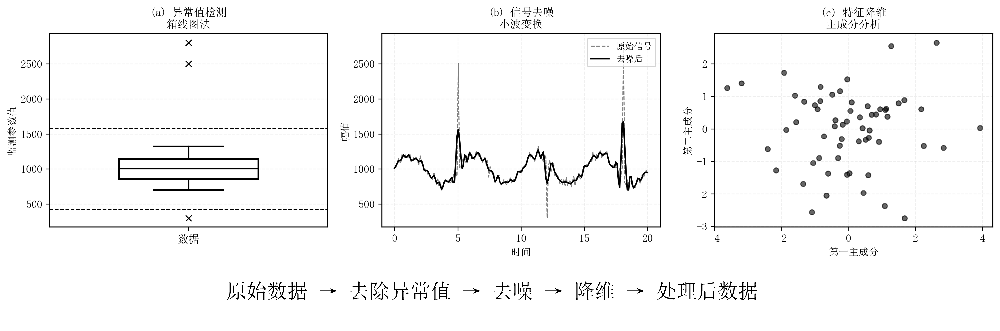
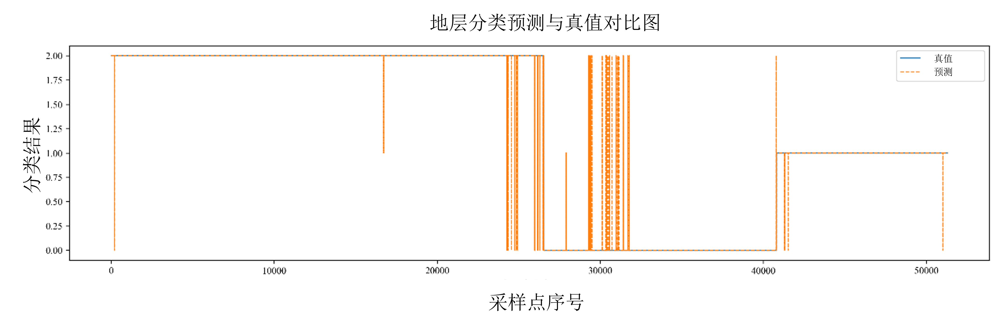

# 一种基于一维卷积神经网络与特征解耦机制的盾构掘进地层自适应分类与动态智能感知方法及系统

## 技术领域

本发明属于地下工程施工智能化与人工智能应用技术领域，具体涉及盾构/隧道掘进施工中的地层识别与感知技术，尤其是一种基于一维卷积神经网络与特征解耦机制的盾构掘进地层自适应分类与动态智能感知方法及系统。

## 背景技术

随着城市地下空间的快速开发，盾构法因施工效率高、环境扰动小而成为轨道交通、市政管廊及过江过海隧道的主流施工方法。盾构掘进过程受地层类型、地下水状态、应力场分布及施工参数耦合作用影响显著，不同地层对刀盘扭矩、推进力、推进油缸压力、千斤顶行程与推进速度等监测参数的响应模式差异明显。准确、及时地识别当前或前方地层类别，是制定掘进参数、优化姿态控制和防范风险（如地表沉降、刀盘卡滞、管片损伤等）的前提条件。

现有工程实践中，地层识别主要依赖两类信息源：

第一类为前期地质勘察报告。该类信息具有抽样稀疏、时空分辨率有限、与实际掘进面不完全一致的天然局限，难以准确反映掘进过程中的实时地层变化。

第二类为现场操作人员的经验判断。该方法具有主观性强、实时性不足、难以标准化与规模化复用等问题。在复杂或突变地层（如软硬交错、富水砂层、夹孤石、断裂带）条件下，传统手段往往难以及时反映掘进面实际状态，导致参数调整滞后、控制策略保守，进而影响工效与施工安全。

近年来，数据驱动的机器学习方法被尝试用于盾构数据分析，包括利用统计学习或浅层模型（如支持向量机、随机森林、K近邻等）进行地层判别。然而，该类方法通常依赖人工特征工程，对变量非线性和高维耦合关系的刻画能力有限，且多在离线场景验证，难以满足工程现场对低时延与高鲁棒性的实时识别需求。

部分深度学习研究虽能挖掘复杂特征，但存在以下不足：第一，未充分区分"受控制台指令主导的主动量"与"反映地层反馈的被动量"，导致控制信号与地层信息高度耦合、特征污染，影响识别准确性与可解释性；第二，模型结构与推理流程未针对嵌入式或边缘侧部署优化，计算与存储开销较大，现场实时落地难度高。

此外，盾构监测数据在工程现场还具有明显的工程噪声与质量不一致问题，包括传感器漂移、数据缺失、异常尖峰、不同采样周期与时间对齐偏差等。若缺乏系统化的异常检测、去噪与冗余抑制机制，模型易受无效信息干扰而产生误判。再者，现有方法多采用固定数据配方与静态模型参数，缺少随掘进推进而持续自学习、适配不同阶段工况或地层变迁的能力，难以在长距离、多地层跨越的实际工程中保持稳定性能。

综上，现有技术至少存在以下技术问题：（1）缺乏面向盾构工况的特征解耦机制，难以将地层反馈从控制动作影响中有效分离；（2）地层识别模型对高维非线性耦合的表征不足，且实时推理与嵌入式部署适配性差；（3）缺少覆盖异常检测、去噪、降维、自适应更新的一体化数据治理与在线学习框架；（4）与盾构控制系统的闭环集成度不高，识别结果难以低时延反馈用于参数与姿态的动态优化。

## 发明内容

### 发明要解决的技术问题

本发明旨在解决现有盾构掘进地层识别技术中存在的以下关键问题：
- 地层信息与控制指令高度耦合，导致识别模型难以准确区分地质变化与操控响应；
- 传统模型依赖人工特征选择，对高维非线性数据的学习能力有限，无法充分提取地层相关信息；
- 缺乏统一的数据预处理与自适应更新机制，模型易受噪声、异常值和工况变化影响；
- 现有方法多在离线环境运行，难以实现嵌入式平台上的实时推理与闭环反馈。

因此，本发明的技术目标是构建一种具备特征解耦、实时识别与自适应更新能力的地层智能感知体系，实现盾构掘进过程中对地层类别的动态、精准与稳定识别，为后续掘进参数预测和姿态控制提供可靠输入。

### 技术方案

为实现上述技术目标，本发明提供一种基于一维卷积神经网络与特征解耦机制的盾构掘进地层自适应分类与动态智能感知方法，包括以下步骤：

**步骤S1：数据采集步骤**

通过盾构机监测系统实时获取掘进过程中的多源运行参数，所述多源运行参数包括刀盘转速、刀盘扭矩、推进力、推进油缸压力、推进速度、贯入度、千斤顶行程及姿态信息。所有参数按统一采样频率与时间戳同步采集，形成多维时间序列数据。

**步骤S2：数据预处理步骤**

对采集到的数据进行系统化预处理，包括：

（a）异常值检测：采用基于四分位间距（IQR）的箱线图法识别并剔除异常点；

（b）信号去噪：使用离散小波变换进行分解与重构，抑制高频噪声并保留主趋势；具体地，采用Daubechies小波族中的db10小波基执行一层小波分解与重构；

（c）特征降维：利用主成分分析（PCA）提取主要特征分量，降低数据维度与冗余性。

经处理后的数据构成高质量输入特征集。

**步骤S3：特征解耦步骤**

根据各监测参数与控制信号之间的响应关系，将所述监测参数划分为主动量与被动量：

所述主动量是指受盾构控制台指令主导的参数，所述被动量是指主要反映地层环境反馈的参数。

通过对两类特征的协方差分析与响应系数判定，实现地层特征与操控特征的有效分离，为后续识别提供清晰输入。

**步骤S4：特征提取与分类步骤**

将经特征解耦与标准化处理的多维特征输入至一维卷积神经网络模型进行特征提取与分类识别，输出当前掘进点的地层类别，实现实时识别。

所述一维卷积神经网络模型包括：

第一卷积层，通道数为16，卷积核大小为3，用于提取局部参数组合特征；

第二卷积层，通道数为32，卷积核大小为3，用于进一步提取深层特征；

批归一化层与ReLU激活函数，用于加速收敛与增强非线性表达；

扁平化层与全连接层，隐藏节点数为64，并采用Dropout正则化（Dropout率为0.3），用于综合判断；

Softmax输出层，用于生成地层等级分类概率分布。

**步骤S5：自适应学习步骤**

为适应掘进过程中地层变化，当新数据采集后，系统根据预测结果与验证数据差异动态调整网络权重，实现增量微调与持续优化，从而保持模型对不同阶段地层的稳定识别能力。具体地，通过监测模型在新数据批次上的损失函数变化，自动触发权重微调，实现增量训练与在线优化。

**步骤S6：反馈输出步骤**

将地层识别结果实时反馈至盾构控制系统，实现与掘进参数控制台的数据联动。识别结果可用于动态修正推进速度、刀盘转速与姿态参数，形成感知-决策-执行闭环控制。

本发明还提供一种用于实现上述方法的盾构掘进地层自适应分类与动态智能感知系统，包括：

数据采集单元，用于采集盾构机多源运行参数；

数据预处理单元，用于执行异常检测、去噪及降维；

特征解耦单元，用于区分主动量与被动量特征；

地层分类单元，用于通过一维卷积神经网络提取特征并输出地层类别；

自适应学习单元，用于根据实时数据更新模型参数；

反馈控制单元，用于将识别结果反馈至盾构控制系统以实现参数自动调节。

### 有益效果

与现有技术相比，本发明具有以下有益效果：

（1）特征解耦创新：通过主动量与被动量的区分机制，有效消除控制信号干扰，显著提高地层特征纯度与模型可解释性，解决了现有技术中控制信号与地层信息高度耦合的技术问题。

（2）高精度与高实时性：采用轻量化一维卷积神经网络结构，识别精度可达99%以上，推理延迟小于1秒，适用于工程现场的实时监测需求，解决了现有方法实时性不足的技术问题。

（3）数据治理完备：集成异常检测、小波去噪与主成分分析降维的多级预处理流程，显著提升数据质量与建模稳定性，有效应对工程现场数据噪声与质量不一致问题。

（4）自学习与可扩展性：模型可随掘进数据动态更新，具备持续演化与跨工程迁移能力，解决了现有方法采用静态模型参数、难以适应不同阶段工况变化的技术问题。

（5）系统级集成性：可直接嵌入盾构机控制系统，实现地层识别与参数调控的闭环联动，提升施工安全性与自动化水平，解决了现有方法与盾构控制系统闭环集成度不高的技术问题。

## 附图说明

为了更清楚地说明本发明的技术方案，结合附图对实施例进行说明，但本发明不限于下述附图所示的具体结构。

**图1** 为本发明方法的总体流程图，显示了从盾构掘进监测数据采集、数据预处理、特征解耦、地层分类识别、自适应学习到系统反馈的完整流程，以及各步骤之间的数据流向。

**图2** 为本发明系统结构示意图，包括数据采集单元、数据预处理单元、特征解耦单元、地层分类单元、自适应学习单元及反馈控制单元，各单元之间通过数据总线实现信息交互，并标注了各单元的主要功能模块。

**图3** 为数据预处理流程示意图，展示了异常值检测（箱线图法）、信号去噪（小波变换）和特征降维（主成分分析）三个子步骤的处理过程，以及各步骤的输入输出数据特征。

**图4** 为特征解耦机制原理示意图，展示了主动量（受控制信号主导参数）与被动量（地层反馈参数）的区分与提取过程，包括协方差矩阵计算、响应系数分析和特征分类判定步骤，以及解耦前后的特征对比。

**图5** 为一维卷积神经网络（1D-CNN）结构示意图，包含输入层、第一卷积层（通道数16）、第二卷积层（通道数32）、批归一化层、ReLU激活层、扁平层、全连接层（节点数64）及Softmax输出层，展示地层特征在网络中的逐层提取与输出分类机制，并标注了各层的参数配置。

**图6** 为自适应学习机制流程图，展示了新数据采集、损失函数计算、阈值判断、权重微调和模型更新的完整流程，以及自适应学习与模型推理的交互关系。

**图7** 为地层识别结果与地质勘探结果对比图，包括横坐标为掘进里程、纵坐标为地层类别的对比曲线，用于说明模型识别结果与实际地勘报告在不同掘进区段的对应关系，可视化验证本发明方法的准确性与可靠性。

## 具体实施方式

下面结合具体实施例对本发明进行详细说明，但本发明不限于以下实施例。

**实施例1**

本实施例提供一种基于一维卷积神经网络与特征解耦机制的盾构掘进地层自适应分类与动态智能感知方法，具体实施步骤如下：

**步骤1：数据采集**

通过盾构机监测系统实时获取掘进过程中的多源运行参数，包括刀盘转速、刀盘扭矩、推进力、推进油缸压力、推进速度、贯入度、千斤顶行程及姿态信息。采样频率设置为1 Hz，所有参数按统一时间戳同步采集，形成多维时间序列数据。

**步骤2：数据预处理**

（1）异常值检测：采用基于四分位间距（IQR）的箱线图法，计算各参数的第一四分位数（Q1）和第三四分位数（Q3），设定异常值判定阈值为Q1-1.5×IQR和Q3+1.5×IQR，超出该范围的数值被识别为异常点并剔除。

（2）信号去噪：采用Daubechies小波族中的db10小波基对预处理后的时间序列进行一层小波分解，提取近似系数（低频分量）并重构，抑制高频噪声，保留主趋势信息。

（3）特征降维：对去噪后的数据进行主成分分析（PCA），保留累计贡献率达到95%以上的主成分，将原始高维特征空间降至低维特征空间，降低数据维度与冗余性。

**步骤3：特征解耦**

根据各监测参数与控制信号之间的响应关系，将监测参数划分为主动量与被动量：

主动量包括：推进速度、刀盘转速，这些参数直接受盾构控制台指令控制；

被动量包括：刀盘扭矩、推进油缸压力、贯入度，这些参数主要反映地层环境对掘进过程的反馈。

通过计算控制信号与各监测参数之间的协方差矩阵，分析响应系数，当响应系数大于设定阈值（如0.7）时，判定为主动量；当响应系数小于设定阈值时，判定为被动量。通过该机制实现地层特征与操控特征的有效分离。

**步骤4：特征提取与分类**

将经特征解耦与标准化处理的多维特征输入至一维卷积神经网络模型。该模型的具体结构如下：

- 输入层：接收标准化后的多维特征向量；

- 第一卷积层：卷积核大小为3，通道数为16，步长为1，采用零填充，输出特征图；

- 批归一化层：对第一卷积层输出进行批归一化处理；

- ReLU激活层：对批归一化后的特征进行非线性激活；

- 第二卷积层：卷积核大小为3，通道数为32，步长为1，采用零填充；

- 批归一化层：对第二卷积层输出进行批归一化处理；

- ReLU激活层：对批归一化后的特征进行非线性激活；

- 扁平化层：将多维特征图展平为一维向量；

- 全连接层：隐藏节点数为64，采用Dropout正则化，Dropout率为0.3；

- Softmax输出层：输出地层类别的概率分布，包括I级（软土）、II级（硬岩）、III级（交错层）等多个类别。

模型训练采用交叉熵损失函数，优化器采用Adam算法，学习率设置为0.001，批次大小为32，训练轮数为100。

**步骤5：自适应学习**

当新数据采集后，系统计算模型预测结果与验证数据（如地质勘察报告标注）的差异，当损失函数值超过设定阈值（如0.1）时，自动触发模型权重微调。采用小学习率（0.0001）对模型进行增量训练，实现在线优化，保持模型对不同阶段地层的稳定识别能力。

**步骤6：反馈输出**

将地层识别结果实时反馈至盾构机主控单元，主控单元依据识别结果自动调整刀盘转速、推进速度及姿态控制参数。例如，当识别为硬岩地层时，系统自动降低推进速度并提高刀盘转速；当识别为软土地层时，系统自动提高推进速度并降低刀盘转速，形成感知-决策-执行闭环控制。

**实施例2**

本实施例提供一种用于实现实施例1所述方法的盾构掘进地层自适应分类与动态智能感知系统，该系统采用模块化架构设计，包括以下功能单元：

**（1）数据采集单元**

数据采集单元与盾构机控制台的数据总线（如CAN总线或以太网）直接通信，采样频率可配置为1 Hz至10 Hz。该单元包括多路数据采集接口、时间戳同步模块和数据缓存模块。数据采集接口实时采集盾构机多源运行参数，包括刀盘转速、刀盘扭矩、推进力、推进油缸压力、推进速度、贯入度、千斤顶行程及姿态信息。时间戳同步模块确保所有参数按统一时间戳同步采集，数据缓存模块临时存储采集数据，形成多维时间序列数据流。

**（2）数据预处理单元**

数据预处理单元包括异常检测模块、去噪模块和降维模块，各模块采用流水线方式顺序处理数据。

异常检测模块：采用基于四分位间距（IQR）的箱线图法，对采集到的各参数进行实时异常检测，自动识别并剔除离群值。

去噪模块：采用离散小波变换算法，使用Daubechies小波族中的db10小波基对时间序列进行一层小波分解与重构，抑制高频噪声并保留低频主趋势。

降维模块：采用主成分分析（PCA）算法，对去噪后的数据进行特征降维，提取累计贡献率达到95%以上的主成分，降低数据维度与冗余性。

**（3）特征解耦单元**

特征解耦单元通过协方差分析与响应系数判定机制，区分主动量与被动量特征。该单元包括协方差计算模块、响应系数分析模块和特征分类模块。协方差计算模块计算控制信号与各监测参数之间的协方差矩阵；响应系数分析模块分析各参数的响应系数；特征分类模块根据响应系数阈值（如0.7）将参数划分为主动量（推进速度、刀盘转速等）和被动量（刀盘扭矩、推进油缸压力、贯入度等），实现地层特征与操控特征的有效分离。

**（4）地层分类单元**

地层分类单元采用轻量化一维卷积神经网络结构，部署在嵌入式计算平台（如ARM处理器或FPGA）上。该单元包括模型推理引擎和结果输出模块。模型推理引擎执行一维卷积神经网络的前向推理，网络结构包括两层卷积层（通道数分别为16和32，卷积核大小为3）、批归一化层、ReLU激活层、扁平层、全连接层（隐藏节点数为64，Dropout率为0.3）和Softmax输出层。结果输出模块输出地层类别的概率分布，包括I级（软土）、II级（硬岩）、III级（交错层）等多个类别。

**（5）自适应学习单元**

自适应学习单元监测模型在新数据批次上的损失函数变化，当损失函数值超过设定阈值（如0.1）时，自动触发权重微调。该单元包括损失计算模块、阈值判断模块和增量训练模块。损失计算模块计算模型预测结果与验证数据（如地质勘察报告标注）的差异；阈值判断模块判断是否需要触发模型更新；增量训练模块采用小学习率（0.0001）对模型进行增量训练，实现在线优化，保持模型对不同阶段地层的稳定识别能力。

**（6）反馈控制单元**

反馈控制单元将地层识别结果实时反馈至盾构机主控单元，实现参数自动调节。该单元包括结果传输模块和控制策略模块。结果传输模块通过数据总线将识别结果传输至盾构机主控单元；控制策略模块根据识别结果生成控制策略，例如当识别为硬岩地层时，系统自动降低推进速度并提高刀盘转速；当识别为软土地层时，系统自动提高推进速度并降低刀盘转速，形成感知-决策-执行闭环控制。

**系统架构特点**

所述系统采用轻量化计算框架实现模型运行优化，包括模块化任务调度、参数共享和并行计算。各功能单元通过数据总线实现信息交互，采用消息队列机制保证数据流的实时性和可靠性。系统支持在有限计算资源（如单核ARM处理器）下实现实时识别与数据反馈，推理延迟小于1秒，识别精度可达99%以上。

通过上述实施例的实施，本发明实现了在复杂地质条件下对地层类别的高精度、低延迟识别，有效提升了盾构施工的安全性、效率与智能化水平。

## 权利要求书

### 权利要求1

一种基于一维卷积神经网络与特征解耦机制的盾构掘进地层自适应分类与动态智能感知方法，其特征在于，包括以下步骤：

数据采集步骤：通过盾构机监测系统实时采集掘进过程中的多源运行参数，所述多源运行参数包括刀盘转速、刀盘扭矩、推进油缸压力、推进力、推进速度、贯入度及千斤顶行程；

数据预处理步骤：对采集到的数据进行异常检测、去噪及降维处理，其中：
(a) 异常检测采用基于四分位间距的箱线图法剔除离群值；
(b) 去噪采用离散小波变换分解与重构保留低频主趋势；
(c) 降维采用主成分分析提取主要特征分量；

特征解耦步骤：根据各监测参数与控制信号之间的响应关系，将所述监测参数划分为主动量与被动量，所述主动量反映控制指令特征，所述被动量反映地层反馈特征；

特征提取与分类步骤：将经特征解耦与标准化后的多维特征输入一维卷积神经网络模型进行特征提取与分类识别，输出当前掘进点的地层类别；

自适应学习步骤：根据新采集数据的实际分类结果与模型输出的差异，动态调整神经网络权重，实现模型的在线增量学习与持续优化；

反馈输出步骤：将地层识别结果实时反馈至盾构控制系统，以实现掘进参数的动态调节。

### 权利要求2

根据权利要求1所述的方法，其特征在于，所述去噪处理采用Daubechies小波族中的db10小波基执行一层小波分解与重构。

### 权利要求3

根据权利要求1所述的方法，其特征在于，所述特征解耦步骤中主动量与被动量的区分基于控制信号与监测参数之间的协方差分析与响应系数判定完成。

### 权利要求4

根据权利要求1所述的方法，其特征在于，所述一维卷积神经网络包括：
第一卷积层，通道数为16，卷积核大小为3；
第二卷积层，通道数为32，卷积核大小为3；
批归一化层与ReLU激活层；
扁平化层与全连接层，隐藏节点数为64，并采用Dropout正则化；
Softmax输出层，用于生成地层等级分类概率分布。

### 权利要求5

根据权利要求1所述的方法，其特征在于，所述自适应学习步骤通过监测模型在新数据批次上的损失函数变化，自动触发权重微调，实现增量训练与在线优化。

### 权利要求6

根据权利要求1所述的方法，其特征在于，所述反馈输出步骤包括将地层识别结果传输至盾构机主控单元，由主控单元依据识别结果自动调整刀盘转速、推进速度及姿态控制参数。

### 权利要求7

根据权利要求1所述的方法，其特征在于，所述降维处理除主成分分析外，还结合特征相关性分析以剔除低贡献度或冗余变量。

### 权利要求8

根据权利要求1所述的方法，其特征在于，所述一维卷积神经网络模型采用轻量化结构设计以支持实时计算，包括减少参数规模、使用共享权重及简化激活函数运算，以 降低计算延迟并保证推理速度。

### 权利要求9

根据权利要求1所述的方法，其特征在于，所述地层识别结果采用分类标签编码方式表示，包括I级、II级、III级或软土、硬岩、交错层等多个类别。

### 权利要求10

一种用于实现权利要求1至9任一项所述方法的盾构掘进地层自适应分类与动态智能感知系统，其特征在于，包括：
数据采集单元，用于采集盾构机多源运行参数；
数据预处理单元，用于执行异常检测、去噪及降维；
特征解耦单元，用于区分主动量与被动量特征；
地层分类单元，用于通过一维卷积神经网络提取特征并输出地层类别；
自适应学习单元，用于根据实时数据更新模型参数；
反馈控制单元，用于将识别结果反馈至盾构控制系统以实现参数自动调节。

### 权利要求11

根据权利要求10所述的系统，其特征在于，所述数据采集单元与盾构机控制台的数据总线直接通信，采样频率为1 Hz至10 Hz，以确保采样数据的同步性与实时性。

### 权利要求12

根据权利要求10所述的系统，其特征在于，所述系统采用轻量化计算框架实现模型运行优化，包括模块化任务调度、参数共享和并行计算，以保证系统在有限计算资源下实现实时识别与数据反馈。

以上所述仅为本发明的较佳实施例，并非对本发明作任何形式上的限制。虽然本发明已以较佳实施例揭露如上，然而并非用以限定本发明。任何熟悉本领域的技术人员，在不脱离本发明技术方案范围的情况下，都可利用上述揭示的技术内容对本发明技术方案做出许多可能的变动和修饰，或修改为等同变化的等效实施例。因此，凡是未脱离本发明技术方案的内容，依据本发明的技术实质对以上实施例所做的任何简单修改、等同变化及修饰，均仍属于本发明技术方案保护的范围内。
