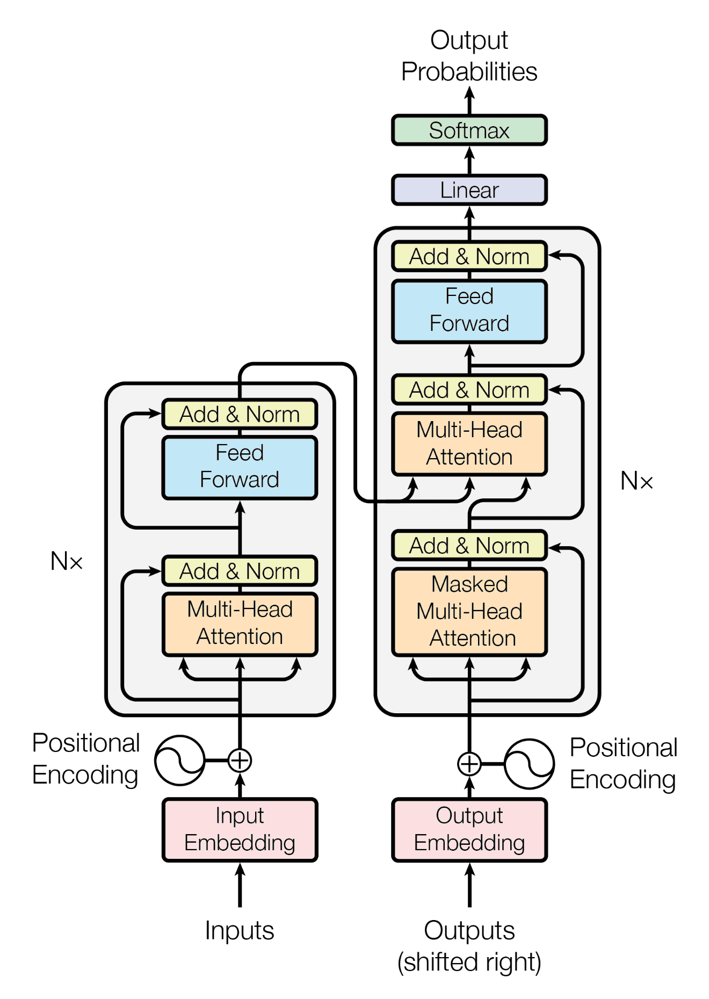
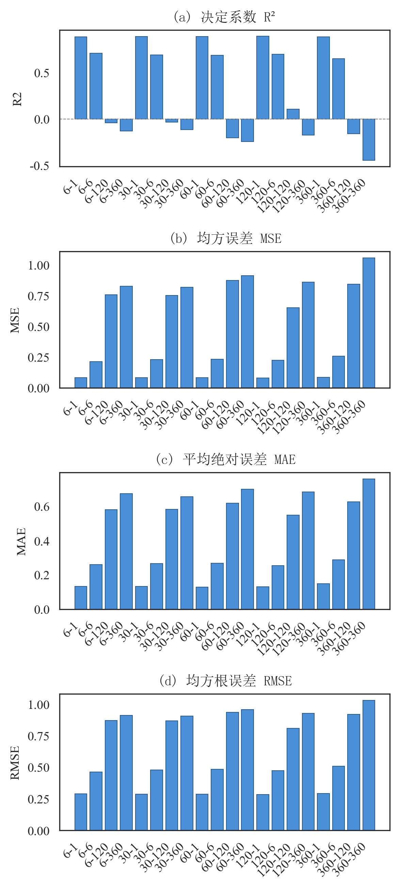
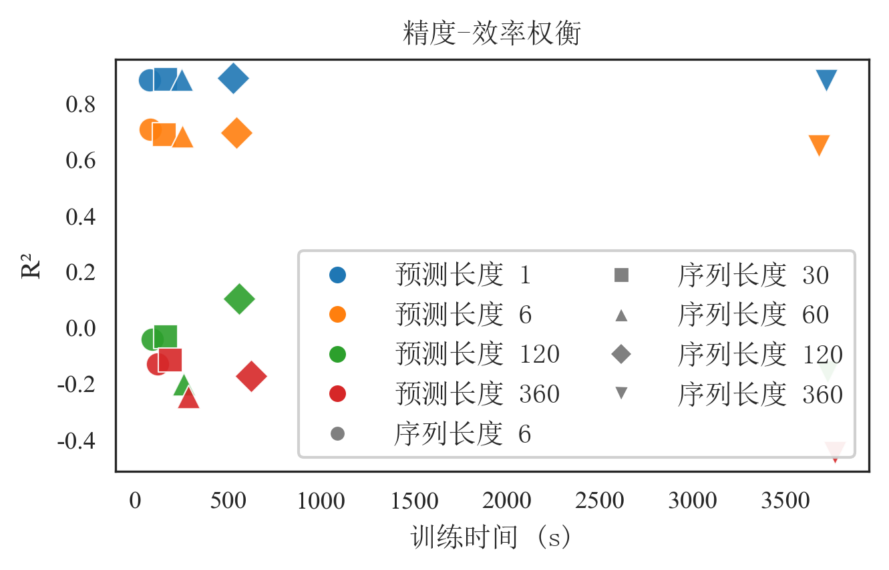
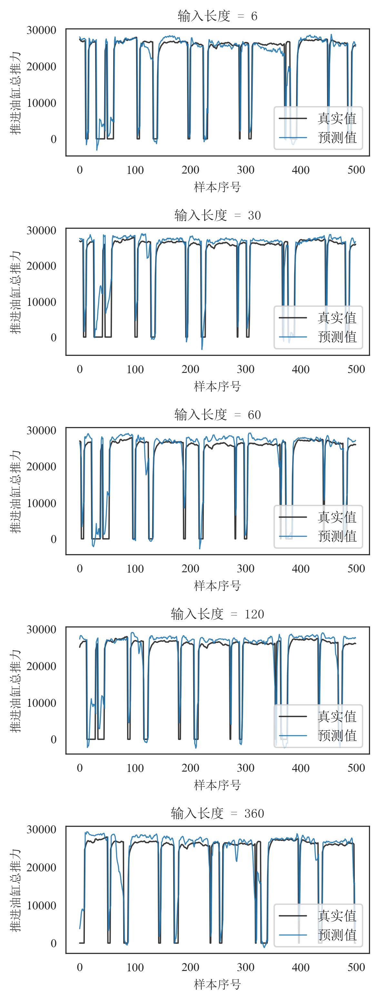

# 基于 Transformer 的盾构掘进关键参数多时间尺度预测研究

Multi-Time-Scale Prediction of Key Shield Tunnelling Parameters Based on Transformer

李奇涛1，姜红峰2，崔帅文3，徐金峰4

1. 【单位待补充】  
2. 【单位待补充】  
3. 【单位待补充】  
4. 【单位待补充】

通讯作者：李奇涛，E-mail: 309943855@qq.com

---

摘要：盾构在复杂地层中掘进时，贯入度、推力、刀盘扭矩等关键参数的准确预测对施工安全与效率具有重要意义；尤其在穿越软硬交替、多类地层交汇或下穿敏感建构筑物等复杂地质与环境条件下，实时或短时预测可为掘进参数调整与风险预警提供依据，有助于实现主动控制、减少开挖面失稳与地表沉降等风险。多变量时间序列预测中，“用多长历史、预测多远”的配置选择普遍制约预测精度与计算成本，但在同一模型下系统量化输入长度与预测长度联合影响的研究仍较缺乏。本文以盾构掘进关键参数预测为应用对象，针对多变量强耦合与长程依赖的时序特点，采用 Transformer 编码器结构，系统考察 5 种输入序列长度与 4 种预测长度共 20 种组合下的预测精度与计算效率。结果表明：预测长度是主导精度的首要因素，单步预测下精度高且对输入长度不敏感，随预测长度增大精度显著下降；输入长度在单步预测下存在边际收益递减，过长输入带来计算成本上升而精度提升有限；长预测时输入与预测长度相匹配有利于缓解精度恶化，但直接长时多步预测效果仍有限。本文从信息瓶颈与可预测性时域两个理论视角对上述现象给出统一解释，并指出输入–预测长度在时间尺度上的对齐有助于缓解长预测下的性能退化。工程启示为：复杂地层中实时或资源受限场景宜采用较短输入与单步（或短步）预测以兼顾精度与成本；精度优先的离线分析可选用适中输入长度配合单步预测；若需中长期预测，应优先考虑输入与预测长度匹配或采用滚动预测、与机理/统计模型相结合。本文结果为复杂地层盾构施工智能化中的关键参数实时预测与配置选型提供了实证依据与理论支撑，所得规律对采用类似架构的其它多变量时序预测任务具有参考价值。

关键词：盾构掘进；Transformer；时间序列预测；多时间尺度；深度学习

Abstract: Accurate prediction of key shield tunnelling parameters such as penetration rate, thrust and cutterhead torque is of great importance to construction safety and efficiency when shield tunnelling is carried out in complex strata. Especially under complex geological and environmental conditions such as alternating soft and hard layers, intersection of multiple strata, or undercrossing sensitive structures, real-time or short-term prediction can provide a basis for adjusting tunnelling parameters and for risk early warning, and can help achieve proactive control and reduce risks such as face instability and surface settlement. In multi-variable time series forecasting, the choice of “how much history to use and how far to predict” (input length and prediction length) generally constrains both prediction accuracy and computational cost, but systematic quantification of their joint effect under a single model is still lacking. This paper takes key shield tunnelling parameter prediction as the application, addresses the characteristics of strong multi-variable coupling and long-range dependence in the time series, adopts a Transformer encoder, and systematically examines prediction accuracy and computational efficiency under 5 input sequence lengths and 4 prediction lengths (20 combinations in total). The results show that prediction length is the primary factor governing accuracy: one-step prediction achieves high accuracy and is largely insensitive to input length, while accuracy decreases markedly as prediction length increases; input length exhibits diminishing marginal returns for one-step prediction, with longer input increasing computational cost but yielding limited gain in accuracy; for long-horizon prediction, matching input length to prediction length helps mitigate accuracy degradation, but direct long-horizon multi-step prediction remains limited. This paper gives a unified interpretation of the above phenomena from two theoretical perspectives—information bottleneck and predictability horizon—and points out that alignment of input and prediction lengths in temporal scale helps mitigate performance degradation in long-horizon prediction. Practical implications are: for real-time or resource-constrained scenarios in complex strata, shorter input and one-step (or short-horizon) prediction are recommended to balance accuracy and cost; for accuracy-oriented offline analysis, moderate input length with one-step prediction may be used; when medium- or long-term prediction is required, priority should be given to matching input and prediction lengths or to rolling prediction combined with mechanistic or statistical models. The results provide empirical basis and theoretical support for real-time prediction of key parameters and for configuration selection in intelligent shield tunnelling in complex strata, and the findings are of reference value for other multi-variable time series forecasting tasks that use similar architectures.

Keywords: shield tunnelling; Transformer; time series forecasting; multi-time-scale; deep learning

---

## 1 引言

### 1.1 研究背景与意义

盾构在复杂地层中掘进时，贯入度、推力、刀盘扭矩等关键参数的准确预测对施工安全与效率具有重要意义。尤其在穿越软硬交替、多类地层交汇或下穿敏感建构筑物等复杂地质与环境条件下，实时或短时预测可为掘进参数调整与风险预警提供依据，有助于实现主动控制、减少开挖面失稳与地表沉降等风险。盾构施工中推进、刀盘、土压等多子系统参数强耦合，且地层与机况在数分钟尺度上具有延续性，是多变量、长程依赖时序预测的典型场景，因此将数据驱动的多变量时序预测方法引入盾构关键参数预测具有明确的工程需求。

从方法层面看，多变量时间序列预测在工业过程、能源、交通、土木施工等领域具有共性：预测目标往往具有多时间尺度属性——单步或短期预测服务于实时控制与操作辅助，中长期预测则支持调度与风险评估。无论具体应用场景如何，“用多长历史（输入序列长度 T）、预测多远（预测长度 H）”都是模型设计与部署时必须面对的基本问题：T 与 H 的选取直接制约预测精度与计算成本。然而，现有研究多针对单一 (T, H) 或单一时间尺度开展，在同一模型与数据下系统考察 T、H 对精度与效率的联合影响、并从表示能力与可预测性理论角度加以解释的工作仍较为缺乏，导致配置选型缺乏普适性的实证规律与理论依据。

### 1.2 相关工作

多变量时序预测方面，既有工作广泛采用机理-数据混合模型、统计模型（如 ARIMA、卡尔曼滤波）或浅层机器学习（如 SVM、随机森林），在单步或短时预测上取得一定效果，但对多变量强耦合与长程时间依赖的联合建模能力有限。LSTM、GRU 等循环网络被引入以刻画时序依赖，在部分工程场景中取得进展，但在长序列上存在训练效率低、梯度传递衰减等问题，且多数工作未在同一框架下系统考察输入长度与预测长度的联合影响。在通用时序与深度模型方面，Transformer 因其自注意力机制可在 $O(T^2)$ 复杂度下对任意位置对直接建模，在长程依赖与并行计算上具有优势，已被广泛应用于自然语言处理与部分时序任务；在时序场景中，常见做法包括编码器-解码器（编码历史、解码逐步生成）、仅编码器加直接多步输出（本文采用）以及 Informer、Autoformer 等变体。在工业与土木等应用领域（如盾构掘进参数预测），现有研究多针对特定输入长度与预测长度或单一时间尺度开展评估，缺乏在同一数据与模型下对多种 (T, H) 组合的系统对比，也少有从表示能力与可预测性理论角度对“用多长历史、预测多远”的选型规律进行解读。针对上述问题，尚未见在固定仅编码器加单线性多步输出前提下、系统量化 T 与 H 对精度与效率的联合影响并从信息瓶颈与可预测性时域两个理论视角给出统一解释的研究。

### 1.3 研究内容与全文结构

本文以盾构掘进关键参数预测为应用载体，数据来源于某城市地铁区间（春光路站—春秋路站）盾构施工实时监测系统，区间穿越多类地层并下穿桥梁与管线，具有代表性与工程价值。在固定采用仅编码器加单线性多步输出的 Transformer 前提下，设置 5 种输入序列长度 T 与 4 种预测长度 H、共 20 组 (T, H) 配置，在同一数据与训练设定下系统考察其对预测精度（MSE、MAE、RMSE、R²）与计算效率（训练时间、推理时间、内存）的联合影响，并从信息瓶颈（单一上下文向量编码多步未来）与可预测性时域（预测跨度与条件不确定性增长）两个理论视角对现象给出统一解释，提炼可推广的选型原则与适用边界，为盾构施工智能化中的配置选型与时间尺度设计提供实证与理论依据，并对采用类似架构的其它多变量时序预测任务具有参考价值。

全文结构如下：第 2 节给出问题定义、数据与预处理、Transformer 模型及评估指标；第 3 节说明实验设计；第 4 节报告结果并进行分析，包括从架构与时间尺度理论对性能的解读；第 5 节总结结论并讨论工程启示与局限。

---

## 2 方法

理论分析是理解模型在多时间尺度下性能边界、解释输入长度与预测长度对精度与效率联合影响的重要基础。本节给出问题形式化、数据与模型设定及评估指标，并为第 4 节的结果解读提供理论铺垫。

### 2.1 问题定义

将盾构掘进关键参数预测形式化如下：给定历史 T 个时间步的 F 维参数序列 $X = {x_{t-T+1}, …, x_t}$，$x_i ∈ ℝ^F$，预测未来 H 个时间步的序列 $Y = {y_{t+1}, …, y_{t+H}}$，$y_i ∈ ℝ^F$。其中每一时间步对应一次采样时刻，F 为掘进参数维度（本文 F＝32）。本文以 5 s 为时间步长，序列长度 T 与预测长度 H 均以“步”计，一步对应 5 s；例如 T＝120 表示以 10 分钟历史为输入，H＝6 表示预测未来 30 秒。模型学习映射 $f_θ: X ↦ Y$，在给定 (T, H) 下通过监督学习拟合参数 $θ$。

多步预测在形式上可分为直接多步：一次映射 $f_θ(X) = Ŷ$，与自回归多步：$ŷ_{t+k} = g_θ(X, ŷ_{t+1}, …, ŷ_{t+k-1})$，逐步生成。本文采用直接多步，即所有未来步由同一前向传播得到，其优点是推理无误差传播、实现简单且延迟确定；代价是模型需从同一表示同时预测多步，远期步的可预测性受限于系统内在的可预测性时域：在动力系统与随机过程理论中，条件方差 $Var(y_{t+h} | X)$ 通常随预测步长 $h$ 增大而增大甚至饱和，即远期不确定性上升，单次映射要同时拟合 $h=1,…,H$ 的分布，表达能力被摊薄。后文将看到，预测长度 H 成为主导精度的首要因素，与上述理论一致；输入长度 T 则决定“用多少历史信息”来形成表示，与系统记忆长度、有效因果时窗有关。

### 2.2 数据与预处理

数据来源于该区间盾构施工实时监测系统，采样间隔 5 s。经合并、去缺与格式统一后，得到以时间顺序排列的连续序列；前 5 列为元数据（管片号、行程、日期、时刻、掘进状态），其后为 32 维数值型掘进参数，包括贯入度、四腔室推进压力、土舱土压、推进油缸总推力、千斤顶速度与行程、刀盘转速与扭矩及 No.1～No.10 刀盘电机扭矩等。对缺失值采用前向与后向填充，保证序列连续可用。按给定序列长度 T 与预测长度 H 滑动构造输入-输出样本，得到若干组 $(X, Y)$；再按 70%∶15%∶15% 沿时间顺序划分为训练集、验证集与测试集，不打乱时序，以避免信息泄露并保证评估的时序一致性。如图 1 所示，32 维参数两两相关系数热力图（横纵轴为特征序号 1～32）反映了参数间的线性相关结构，部分参数间相关性较强，适合多变量联合建模。

  
图1 掘进参数相关系数热力图（32 维，横纵轴为特征序号 1～32）

### 2.3 Transformer 预测模型

在时序预测中，模型架构决定了“用多长历史、预测多远”的可行范围与性能边界，因此对 Transformer 结构与信息流的理论刻画是分析多时间尺度实验结果的前提。Transformer 在时序预测中的重要性在于：其自注意力机制可对序列内任意位置对进行直接建模，从而在无需循环或卷积感受野扩展的前提下实现长程依赖刻画；多头设计便于同时关注不同时间或变量子空间，适合盾构多变量耦合的掘进参数；编码器结构易于扩展层数与隐维度，便于在精度与计算成本间做权衡。本文采用仅含编码器的 Transformer 进行多变量多步预测，其核心为自注意力（self-attention）机制与“最后一时间步表示 + 单层线性输出”的映射方式，二者共同决定了模型在多时间尺度下的性能边界。模型结构如图 2 所示，图中标明了自输入至输出的数据流与各层作用。

  
图2 Transformer 预测模型架构

结构与数据流：输入序列 $X ∈ ℝ^{T × F}$ 经线性层投影到隐维度 $d$（本文 $d=64$），叠加正弦位置编码后送入多层 Transformer 编码器。编码器内每一层包含多头自注意力与前馈子层：自注意力使每一时间步的表示均可依赖整段输入，从而在无需循环的前提下建模长程依赖；多 head（本文 4 头）便于同时关注不同时间或变量子空间。编码器输出为 $T$ 个时间步的隐状态，仅取最后一时间步 $h_T ∈ ℝ^d$ 作为整段历史的压缩表示，再经一层线性映射得到 $Ŷ = W h_T + b$，reshape 为 $(H × F)$ 维，即未来 $H$ 步的预测。其中，$W ∈ ℝ^{d × (H×F)}$、$b ∈ ℝ^{H×F}$ 分别为输出层权重与偏置。因此，无论预测长度 $H$ 为 1 还是 360，所有未来步均来自同一上下文向量 $h_T$ 的线性变换，中间无解码器、无自回归、无逐步修正。

超参数：隐维度 64，注意力头数 4，编码器层数 2，前馈维度 256，Dropout 0.1；训练使用学习率 1×10⁻³、批大小 64、20 个 epoch。

架构带来的性质：（1）并行性：自注意力对序列各位置可并行计算，训练与推理在 GPU 上较高效，但注意力复杂度与序列长度平方相关，故长序列时计算与内存成本显著上升。（2）单步预测天然适配：下一时刻仅需从 $h_T$ 预测一步，$h_T$ 已融合整段历史，信息充分且无误差逐步累积，故单步预测易取得较高精度。（3）长预测的瓶颈：同一 $h_T$ 经单一线性层直接映射到 $H × F$ 个输出，模型既无法为不同未来时刻使用不同表示，也无法像自回归模型那样“先预测 t+1、再以 t+1 为条件预测 t+2”；长预测时表达能力被摊薄，且远期不确定性大，单向量难以编码数十步乃至数百步后的细节，故长预测精度易急剧下降。（4）输入长度的边际收益：自注意力已使最后一步“看到”全部历史，对下一步而言近期历史往往贡献更大；继续拉长输入主要增加远端信息，收益递减，而计算成本随长度明显增加，故存在输入长度的边际收益递减现象。

从信息与表示角度的理论解读：可将当前架构视为“编码器–瓶颈–解码”结构：编码器将 $T × F$ 维输入压缩为 $d$ 维向量 $h_T$，再经单层线性映射展开为 $H × F$ 维输出。根据率失真与表示学习中的常见结论，定长向量在编码多步未来时存在容量上限：若将未来序列视为在给定历史下的条件分布 $p(Y | X)$，则 $h_T$ 需同时承载 $H$ 个时间步的统计信息，当 $H$ 很大时，有效信息被压缩进固定维度，必然带来信息损失；且条件熵 $H(y_{t+h} | X)$ 随 $h$ 增大通常不减（甚至随系统混沌性或噪声累积而增大），即“远期更难预测”在信息论意义下成立。因此，单步预测（$H=1$）仅需从 $h_T$ 解码一步，瓶颈压力最小；$H ≫ 1$ 时同一瓶颈需支撑多步解码，性能下降是结构性的，而非仅调参可解决。后文实验中将看到输入与预测长度“匹配”（如 T=120、H=120）时的局部改善，可解释为时间尺度对齐：编码与解码在相同时间跨度上进行，模型学习“用 120 步历史概括 120 步未来”的粗粒度映射，比“用 6 步历史预测 120 步未来”在表示上更一致，有利于缓解瓶颈压力。

### 2.4 评估指标

预测精度采用均方误差（MSE）、平均绝对误差（MAE）、均方根误差（RMSE）及决定系数 R²。其中 R² 反映模型相对均值基准的解释比例，越接近 1 表示拟合越好，为负表示不如简单均值预测；MSE、MAE、RMSE 从不同角度刻画绝对误差水平。计算性能考虑训练时间（s）、整测试集推理时间（ms）与内存占用（MB），用于评估不同时间尺度配置下的可部署性与资源成本。

---

## 3 实验设计

本节说明实验目标、时间尺度配置、样本与数据划分、训练与评估设置，以保证结果可复现且组间可比。

实验目标：在统一数据与模型前提下，系统改变输入序列长度 T 与预测长度 H，量化二者对预测精度（MSE、MAE、RMSE、R²）与计算效率（训练时间、推理时间、内存占用）的影响，为工程中的配置选型提供实证依据，并支撑第 4 节对精度–效率权衡与模型适用边界的讨论。

时间尺度配置：工程中需根据应用场景选择“用多长历史（T）、预测多远（H）”，不同 (T, H) 对应不同的精度–成本权衡与适用场景，但此前缺乏在同一数据与模型下的系统对比。为给出配置选型的定量依据，本文固定其他条件，将输入序列长度 T 取 6、30、60、120、360 步，预测长度 H 取 1、6、120、360 步，构成 5×4＝20 组配置。时间步长为 5 s，故上述 T 分别对应约 0.5、2.5、5、10、30 分钟历史，H 分别对应约 5 s、30 s、10 min、30 min 预测跨度。每组 (T, H) 独立训练一个模型并单独评估，不共享参数，以便直接比较不同时间尺度组合下的精度与效率。

样本构造与数据划分：按第 2.2 节方法，以滑动窗口方式按给定 T、H 从连续时序构造输入–输出样本；沿时间顺序将样本划分为训练集 70%、验证集 15%、测试集 15%，不打乱顺序以避免信息泄露。验证集用于训练过程中的早停与超参数监控，测试集仅用于最终报告指标，不参与训练与模型选择。

训练设置：模型结构及超参数与第 2.3 节一致（隐维度 64，4 头注意力，2 层编码器，前馈维度 256，Dropout 0.1）；训练采用 Adam 优化器、学习率 1×10⁻³、批大小 64、固定 20 个 epoch，损失函数为均方误差（MSE）。20 组实验除 (T, H) 外其余超参数与数据划分方式完全相同；实验在固定随机种子与相同软硬件环境下进行，以保证组间可比性与结果可复现性。

评估与记录：每组实验在测试集上计算预测精度的 MSE、MAE、RMSE、R²（与第 2.4 节一致），并记录该组从训练开始到结束的 wall-clock 训练时间、整测试集一次前向推理时间及峰值内存占用。上述指标用于第 4 节的精度分析、计算性能分析与精度–效率权衡讨论。

---

## 4 结果与分析

### 4.1 预测精度

20 组实验中，R² 分布于 -0.447（输入长度 360 步、预测长度 360 步）至 0.892（输入长度 120 步、预测长度 1 步）；MSE 自约 0.080 至约 1.056，MAE 自约 0.129 至约 0.758，与“预测长度增加导致误差累积与不确定性增大”的预期一致。

按预测长度分层可见：（1）预测长度 1 步：五种输入长度下 R² 均在 0.884～0.892 之间，输入 120 步时最优（R²=0.892），输入仅 6 步时已达 R²=0.886，说明单步预测对历史长度不敏感。（2）预测长度 6 步：R² 在 0.649～0.710，输入 6 步时最高（0.710），输入 360 步时最低（0.649），过长输入未带来精度提升。（3）预测长度 120 步：仅当输入长度同为 120 步时取得正 R²（0.104），其余均为负，表明输入与预测长度相匹配在该尺度下有利于缓解精度恶化。（4）预测长度 360 步：各配置 R² 均为负，最差约 -0.447，直接长时多步预测在本数据与模型下难度较大。如图 3 所示，四类精度指标在 20 组配置下的表现以柱状图形式给出。

  
图3 预测精度指标在 20 组配置下的表现 （a）R²；（b）MSE；（c）MAE；（d）RMSE

### 4.2 计算性能

训练时间随序列长度与预测长度增加而明显上升，与自注意力复杂度及输出维度随 (T, H) 增大一致。单步预测下，输入 6 步约 80 s，输入 120 步约 529 s，输入 360 步约 3718 s；自 6 步增至 120 步，训练时间增加约 6.6 倍，而 R² 仅自 0.886 提升至 0.892（约 0.6 个百分点），呈现明显的边际收益递减，说明在单步预测场景下采用过长输入从成本上不划算。整测试集推理时间自约 48.6 ms（6 步输入、1 步预测）至约 14.5 s（360 步输入、360 步预测），内存占用自约 484 MB 至约 4104 MB，长序列与长预测配置对部署设备的算力与内存要求较高。如图 4 所示，训练时间、推理时间与内存占用在 20 组上的对比便于在精度与资源之间做权衡。

  
图4 计算性能在 20 组配置下的表现 （a）训练时间；（b）推理时间；（c）内存占用

### 4.3 时间尺度对 R² 的联合影响

如图 5 与图 6 所示，分别以三维曲面与热力图展示 R² 随输入序列长度与预测长度的变化。从曲面与热力图可归纳出以下规律：高 R² 区域集中在预测长度 1 步与 6 步两行，且沿输入长度方向（列方向）变化不大，说明在短预测下增加历史长度对精度提升有限；预测长度 120 步时仅输入 120 步一格为正（0.104），形成热力图上的“对角线亮点”，其余输入长度下均为负；预测长度 360 步时整行为负，右下角 (360, 360) 最低。整体表明预测长度是主导精度的首要因素，输入长度在短预测下为次要因素。工程选型时可先根据应用需求确定预测长度，再在满足精度前提下尽量缩短输入长度以控制计算成本；若需进行中长期预测，可优先考虑输入与预测长度相匹配或采用滚动预测以降低单次预测难度。

  
图5 R² 随序列长度与预测长度变化
  
图6 R² 热力图（行：预测长度；列：序列长度）

### 4.4 精度-效率权衡

如图 7 所示，以训练时间为横轴、R² 为纵轴绘制 20 组配置的散点，颜色表示预测长度，标记形状表示序列长度。高 R² 点均对应预测长度 1 步，其中输入 120 步、预测 1 步以约 529 s 训练获得 R²=0.892；预测长度 6 步时，输入 6 步以约 82 s 达到 R²=0.71，在精度与成本间较为均衡；预测长度 120 步与 360 步的配置普遍 R² 较低或为负且训练成本高。综合精度与效率，单步预测下输入 120 步为较优选择，资源受限时可选用输入 6 步或 30 步以在损失较小精度的前提下降低计算成本。

  
图7 精度-效率权衡（颜色：预测长度；形状：序列长度）

### 4.5 典型预测曲线

为直观展示不同时间尺度配置下的预测效果，选取贯入度作为代表变量（贯入度直接反映掘进效率，是施工控制中的关键指标之一）。固定预测长度分别为 1、6、120、360 步，在各预测长度下依次给出输入长度 6、30、60、120、360 步的五组真实值与预测值曲线（图 8～11，测试集前 500 样本）。从曲线形态可见：预测长度 1 步时五组曲线均能较好跟踪真实值，与 R² 均高于 0.88 的定量结果一致；预测长度 6 步时拟合尚可但波动与偏差较单步增大；预测长度 120 步时仅输入 120 步一组跟踪尚可，其余输入长度下预测明显滞后或偏离；预测长度 360 步时各组偏差均较大，曲线难以跟踪真实变化。上述现象与 4.1～4.3 节的定量结论一致，即预测长度为主导因素，长预测下输入与预测长度相匹配有助于改善效果。

### 4.6 从模型架构对预测性能的解读

本节将前述实验结果与 2.3 节的架构特点对应，从“为何单步优、为何长预测差、为何输入长度边际递减、为何匹配有帮助”四方面给出基于结构的解释。

单步预测普遍高 R²：本模型仅用编码器最后一时间步的隐状态 $h_T$ 经一层线性映射得到预测。对 $H=1$，只需从 $h_T$ 预测一步；$h_T$ 经自注意力已聚合整段输入信息，对“下一时刻”而言信息充足，且无多步误差累积。因此单步预测在 20 组中 R² 均达 0.88 以上，与“单向量 + 单步输出”的架构高度契合。

预测长度增大后精度骤降：同一 $h_T$ 经同一线性层直接输出 $H × F$ 个标量（$H=6,120,360$）。架构上未区分“近期”与“远期”，也未采用自回归或解码器逐步生成，所有未来步共享同一表示与同一映射，模型容量被摊薄；且随 $H$ 增大，远期不确定性上升，单一定长向量难以编码数十步后的细节。这与实验中 预测长度 120/360 步 时 R² 大幅下降甚至为负一致，说明当前仅编码器 + 单线性输出的设计在结构上更适合短预测。

输入长度边际收益递减：自注意力使最后一步已能访问全部输入步，对“下一步”最有用的多为近期历史；继续增加输入长度主要增加更早时段的信息，对单步预测的边际贡献有限。实验中 6 步输入即达 R²=0.886，增至 120 步仅提升至 0.892（约 0.6 个百分点），而训练时间约增 6.6 倍，与“注意力已覆盖全序列 + 单步预测更依赖近期”的机制相符；输入 360 步时 R² 略低于 120 步，可能与更长序列带来的优化难度或过拟合倾向有关。

输入与预测长度“匹配”的局部改善：预测长度 120 步时，仅当输入长度同为 120 步时取得正 R²（0.104）。从结构上看，输入 120 步、输出 120 步在时间尺度上对称，编码器与输出层在“跨度”上一致，模型可能更易学习“用 120 步历史概括并预测 120 步未来”的映射；而输入 6 步、输出 120 步则要求从极短上下文预测长未来，结构上不匹配，精度崩塌。预测长度 360 步时即便输入 360 步仍全部负 R²，说明在本文数据与模型规模下，单向量表示难以支撑 360 步的直接多步预测，需依赖滚动预测或误差修正等策略。

可预测性时域与时间尺度一致性：从时序预测理论角度，可将上述现象归纳为两点。（1）预测长度主导精度对应“可预测性随预测时域衰减”：在多数实际系统中，条件分布 $p(y_{t+h} | x_{1:t})$ 的方差随 $h$ 增大而增大，或有效信号随 $h$ 衰减，R² 随 H 增大而下降是预期现象；本模型采用直接多步且无自回归修正，所有未来步共享同一表示，故 H 的负面影响被进一步放大。（2）输入–预测长度匹配带来局部改善对应“时间尺度对齐”：当 T 与 H 在相同数量级时，编码器学习的“历史概括”与解码器需求的“未来跨度”在时间尺度上一致，表示空间的使用更一致，有利于在固定容量 $h_T$ 下提高有效信息利用；反之，$T ≪ H$ 时模型被迫从短上下文推断长未来，违背“因果时窗”与“可预测性时域”的常识。工程上可据此制定选型原则：先根据业务确定所需预测时域 H，再在满足精度的前提下选择与 H 相匹配或略长的输入 T，并优先考虑单步或短步预测 + 滚动执行，而非盲目增大 T、H 的直接多步组合。

综上，实验现象可从 Transformer 的“单步上下文 + 单线性多步输出”设计及可预测性时域理论得到一致解释：自注意力带来的长程依赖与并行计算优势在短预测与适中输入长度下得到充分发挥，而单向量多步输出的结构边界与预测时域增大带来的不确定性增长共同决定了 Transformer 在本类任务中的适用尺度。上述分析为后续改进（如引入解码器、自回归、滚动预测或与机理模型结合）指明了方向。

  
图8 贯入度：真实值与预测值（预测长度 1 步）

  
图9 贯入度：真实值与预测值（预测长度 6 步）

  
图10 贯入度：真实值与预测值（预测长度 120 步）

  
图11 贯入度：真实值与预测值（预测长度 360 步）

---

## 5 结论与讨论

### 5.1 主要结论

（1）预测长度是影响精度的主导因素：单步预测下 R² 普遍在 0.88 以上，预测长度 6 步时降至 0.65～0.71，预测长度 120 步时仅输入 120 步取得正 R²（0.104），预测长度 360 步时各配置均为负 R²。

（2）输入长度在单步预测下存在边际收益递减：自 6 步增至 120 步，R² 仅提升约 0.006，训练时间则由约 80 s 增至约 529 s；输入 360 步时训练约 3718 s 而 R² 略低于 120 步，适中的输入长度（如 60～120 步）更利于在精度与成本间取得平衡。

（3）长预测下输入与预测长度相匹配具有积极作用：预测长度 120 步时仅输入 120 步取得正 R²；预测长度 360 步时直接多步预测效果差，需结合滚动预测或误差修正等策略。

（4）计算成本随序列与预测长度显著增加，实时或资源受限场景宜采用较短序列与短预测；离线高精度分析可选用输入 120 步、预测 1 步的配置。

（5）从模型架构与可预测性理论可对上述现象给出统一解释：编码器仅输出最后一时间步的单一上下文向量，再经一层线性映射直接得到所有未来步，形成“编码–瓶颈–解码”结构，故单步预测时信息瓶颈压力最小、长预测时固定容量被摊薄；条件分布随预测时域的方差增长与可预测性时域衰减在理论上支持“预测长度主导精度”；自注意力已覆盖全输入，延长输入对单步预测边际收益有限；输入与预测长度在时间尺度上“匹配”时，编码与解码跨度一致（时间尺度对齐），有利于长预测下的局部改善。该解释将实验现象与信息论、表示学习及时序可预测性理论联系起来，凸显了 Transformer 在时序预测中的优势（长程依赖、并行性、多变量联合表示）与适用边界，为后续结构改进（如解码器、自回归、滚动预测）提供了依据。

### 5.2 工程应用启示

基于本文实验结果与架构分析，对工程应用提出以下建议。

配置选型：在保持采样间隔与特征维度一致的前提下，新工地可参照本文的 20 组设置进行小规模试验，根据精度与训练/推理时间权衡选择配置。实时或轻量部署可优先输入 6 步或 30 步、预测 1 步，在损失较小精度的前提下显著降低计算成本；精度优先且可接受约 9 分钟训练时可选用输入 120 步、预测 1 步；短期 6 步预测可考虑输入 6 步或 120 步、预测 6 步。长序列与长预测组合（如 360–120、360–360）计算成本高而精度差，不宜作为首选。

部署与扩展：Transformer 在长序列下训练与推理成本较高，更适用于离线高精度分析；对延迟敏感的场景可缩短输入长度或采用轻量化结构。中长期预测（120、360 步）直接多步效果有限，建议采用滚动预测或与机理、统计模型相结合，以兼顾精度与可解释性。

### 5.3 创新点与局限

本文的主要贡献包括：（1）在同一工程与数据基础上，系统考察了 Transformer 在 5×4 共 20 种时间尺度组合下的预测性能，从精度与计算效率两方面进行评估，凸显了 Transformer 自注意力、长程依赖与多变量建模能力在盾构时序预测中的价值；（2）给出了基于实验结果的配置选型启示与边际收益分析，为盾构施工智能化中基于 Transformer 的时间尺度配置提供了依据；（3）从编码器“单步上下文 + 单线性多步输出”的架构特点出发，结合信息瓶颈与可预测性时域两个理论视角，对单步优、长预测差、输入长度边际递减及输入–预测长度匹配效应等现象给出了统一解释，将性能与 Transformer 的结构特性及时序预测中的时间尺度一致性联系起来，为后续模型改进指明了方向，并提供了可推广到其他仅编码器、直接多步的时序模型的选型与解读框架。

本研究存在以下局限：实验限于单一区间、单一机型及固定超参数，结论在更多地层与机型上的泛化能力尚待验证；中长期直接多步预测效果有限，且未与滚动预测、误差修正等方法进行系统对比。后续将在更多地层与机型上验证泛化能力，并探索轻量化 Transformer、输入-预测长度匹配策略及与其他模型的融合，以兼顾精度与实时性。

本文所提出的选型原则与时间尺度设计建议在所述数据与模型条件下能够为配置选型提供依据，并在多数单步与短步预测场景下取得较好精度，但仍面临单一工程数据、固定架构与未系统对比滚动预测与误差修正等方法的局限。未来研究应结合更多区间与机型数据验证泛化能力，并进一步引入滚动预测、解码器或自回归结构及与机理模型、统计模型的融合，以提高中长期预测精度与可解释性；通过多时间尺度联合优化与智能化部署技术的应用，可增强模型在复杂施工条件下的适应性，推动盾构施工智能化中预测与决策环节的深度融合。

---

致谢（可选，按期刊要求添加）

参考文献（按期刊格式另行列出）

作者简介  
李奇涛（1987—），男，本科，电气工程及其自动化专业，高级工程师，主要从事轨道交通、桥梁施工管理工作。

基金项目（若有，按期刊要求添加）

---

*说明：文中图 1～11 由实验数据绘制，其中图 2 为模型架构示意；完整实验指标与数据处理流程可向作者索取或见补充材料。*
